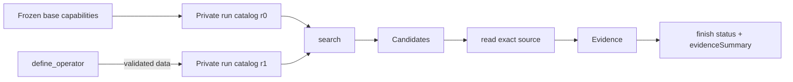

# Picorer Declarative Search Operators

Status: aligned with v1.0.0 engineering review, 2026-09-11

## 1. Decision

Picorer has three layers:

1. the Pi Agent runtime runs the retrieval reasoning loop;
2. one small Skill teaches routing and evidence discipline;
3. search operators produce Candidates from immutable history.

An Agent-created operator is **not TypeScript code**. It is a bounded,
declarative composition of already trusted search capabilities. It cannot open
files, query a database directly, read source memory, call the answer model, or
promote a Candidate to Evidence.

This keeps the public mental model small:

```text
search -> Candidates -> read -> Evidence -> finish
```

Most questions use an existing operator. When the initial catalog cannot
express a useful recall combination, the Agent may define one run-local
operator and invoke it through the same `search` tool.

## 2. Three different concepts

### 2.1 Search capability

A search capability is trusted code owned by the retrieval infrastructure.
Examples include lexical retrieval, semantic retrieval, session expansion, and
temporal retrieval. These capabilities change infrequently and are installed
by composition.

The existing `SearchOperator` interface remains the trusted execution port:

```ts
interface SearchOperator {
  readonly id: string;
  readonly version: string;
  readonly guide: SearchOperatorGuide;
  execute(
    context: SearchOperatorExecutionContext,
    input: SearchOperatorInput,
  ): Promise<SearchOperatorOutput>;
}
```

### 2.2 Operator definition

An operator definition is immutable data: a topologically ordered graph with
**eight** step kinds. `search` invokes a registered capability; `combine` uses
`union`, reciprocal-rank fusion (`rrf`, k=60), or `intersect`. Unary steps are
`filter` (roles), `sort`, `diversify` (session), `dedupe` (content), `limit`, and
`annotate` (temporal or numeric).

The domain accepts at most 12 steps, four search steps, and four inputs to a
combine step. Limits and per-session caps must be integers from 1 to 100. A
search step may use the invocation queries or pin 1–16 fixed queries, each at
most 512 characters. Validation rejects unknown or forward references,
self-recursion, duplicate IDs or combine inputs, invalid output IDs, unreachable
steps, invalid kinds, and missing required caps. The domain also accepts
preloaded definitions; the Agent-facing tool is more restrictive about which
operators it may invoke.

### 2.3 Search invocation

A search supplies the current queries and visible limit. Optional branches are
assembled into a temporary graph using the same validator and executor.
Definitions are reusable; fixed step queries override the invocation queries.
`executedQueries` records the actual primitive paths, including queries inside
nested preloaded plans.

## 3. Agent-facing interface

The tools remain `search -> read -> finish`, with optional `define_operator`:

```ts
define_operator({
  id: "dual-recall",
  summary: "Fuse exact and semantic recall, preserving session breadth",
  steps: [
    { id: "exact", kind: "search", operator: "lexical", limit: 80 },
    { id: "semantic", kind: "search", operator: "hybrid", limit: 80 },
    { id: "merged", kind: "combine", inputs: ["exact", "semantic"], method: "rrf" },
    { id: "spread", kind: "diversify", input: "merged", maxPerGroup: 2 }
  ]
})
```

The Agent supplies step IDs and prior-step references. The harness uses the
last step as output, sets the version and guide defaults, and fills
`by: "session"` / `by: "content"`. Agent-created plans may invoke only IDs in
the initial run catalog, not definitions subsequently created in that run.
The default definition budget remains two per run.

### Execution and discovery constraints

- A role filter directly governing a source can reach the primitive before its
  candidate cutoff. For shared sources, allowed roles are unioned across
  consumers and session caps use the largest required cap; an unconstrained
  consumer prevents that pushdown.
- `sort`, `limit`, content deduplication, and an explicit combine limit stop
  downstream constraint propagation. A diversify step pushes only its own
  session cap. Thus a filter *after* a lossy selection cannot silently change
  which records that selection chose.
- Union is a stable round-robin merge. RRF uses each source rank once;
  intersection retains candidates occurring in every input. Identity is the
  passage ID when present, otherwise the parent memory ID. Duplicate hits from
  one primitive are consolidated before fusion.
- Fusion preserves matched query paths, metadata constraints, fact indexes,
  exact source spans, and temporal facts. Unary transforms retain annotations
  only for surviving sources and invalidate derived summaries when narrowed.
  Combining differently annotated sets requires an explicit later `annotate`.
- `sort(relevance)` sorts by the current numeric score; RRF supplies a common
  score scale when combining heterogeneous retrievers. Time sorting compares
  instants before truncation, with invalid or unknown dates last in either
  direction. The final result always respects the caller's candidate cap.
- Primitive results are checked for scope, passage/source identity, conflicting
  duplicate sources, and cancellation before a later graph step can hide them.

### Existing bounded retrieval budgets

The Agent-visible default remains 20 candidates and the query-local continuation
reservoir remains 80. Hybrid per-route discovery and lexical physical fetches
are capped at 100. Numeric and temporal index primitives retain ceilings of 80
and 60 respectively. Direct lexical calls now use the same physical depth
regardless of visible page size, so increasing the page size does not reorder
the existing prefix. This can increase SQLite work on shallow lexical calls;
it adds no embedding or language-model call. These bounds do not imply complete
recall over an arbitrarily large corpus.

### Time and numeric sidecars

Timestamp parsing validates calendar dates, supports ISO zones and legacy
source formats, and interprets zone-free timestamps in UTC. Relative calendar
expressions and weekday labels use the date written in the source, while
chronology and elapsed durations compare actual instants. A complete date
window includes the last millisecond of its final second.

Numeric extraction retains signs, independent occurrences and exact source
spans. Multiplication requires an adjacent explicit quantity/price expression.
Classification uses local clause context; it remains a deterministic heuristic,
not semantic adjudication. An undated value cannot establish the latest
snapshot. The renderer marks truncated rows and suppresses derived values when
the visible evidence is incomplete.

The fact extractor version is `picorer-evidence-facts-v2`; trusted primitive
versions are `4`. Existing v1 facts and immutable memories remain intact. First
use of a scope builds its missing v2 sidecar locally, without new embeddings;
this consumes local CPU/storage and is covered by an offline migration test.

## 4. DDD ownership

| Context | Owns | Does not own |
|---|---|---|
| `memory` | Immutable records, scopes, sessions, exact reads | Search routing or benchmark labels |
| `retrieval/model` | CandidateSet and declarative definition types | Agent tools or concrete stores |
| `retrieval/use-cases` | Definition validation, graph assembly, run catalog, candidate fusion | Prompts, citations, module loading |
| `retrieval/adapters` | Trusted executable search capabilities | Agent policy |
| `evidence-agent` | Agent tools, per-run lifecycle, Candidate-to-Evidence transition | Concrete database construction |
| `composition` | Base catalog and trusted infrastructure wiring | Runtime routing decisions |
| `benchmark` | Dataset protocol, manifests, scoring | Search semantics |

Benchmark adapters consume only the public Picorer APIs. No dataset identity,
label firewall, answer template, judge protocol, or scoring DTO is defined in
the memory, retrieval, evidence-agent, or interactive-agent contexts.

Dependencies continue to point inward:

```text
entrypoints -> composition -> adapters -> use-cases -> model
benchmark -> evidence-agent -> retrieval -> memory
```

The evidence-agent depends on the `SearchOperatorCatalog` port rather than a
concrete registry implementation. The global base registry is frozen. Each run
receives a private overlay catalog.

## 5. Lifecycle

### Before a run

Composition installs and freezes trusted code-backed capabilities. A caller may
also pass approved declarative definitions through `RunPicorerOptions`.
Preloaded definitions are validated by the same domain builder before the Agent
starts and appear in the initial catalog prompt.

### During a run

`runPicorer` forks an isolated catalog at revision zero. A successful
`define_operator` call adds one definition to that run only and increments the
catalog revision. A later `search` resolves the new ID without rebuilding the
Agent or changing its schema.

`InteractiveMemoryAgentSession` uses the same private-catalog lifecycle for a
whole environment session. This makes the capability available to
knowledge-to-action evaluations without changing their environment tools.

The base registry and sibling runs never observe the mutation.

### After a run

The result and failure diagnostics contain:

- final catalog revision and hash;
- normalized definitions;
- definition hashes and registration revisions;
- tool trace entries for definition and execution;
- per-step candidate counts for composed searches.

This is the promotion boundary. A successful definition can be reviewed,
stored as data, and passed as an approved preloaded definition to a later run.
Picorer v1 does not silently mutate a global catalog or install generated code.

## 6. Candidate and evidence boundary

`CandidateSet` is an internal retrieval value containing ranked immutable
source hits. Declarative nodes only transform CandidateSets. They never receive
an Evidence ledger capability.

Every composed search still enters the existing ledger as Candidates. Exact
source-bound `read` calls are the only way to promote them to Evidence. Each
read source is retained automatically; `finish` only closes retrieval while
the harness deduplicates sources and constructs citations.

Search previews are navigation views, not evidence commitments. For legacy
parent candidates, the ledger privately accumulates exact source spans matching
the bounded previews from each search, including lower-ranked rediscoveries.
When that parent is explicitly read, these spans are mandatory; remaining space
uses the existing query-focused projection. Passage candidates retain their
original hash and offsets. Selecting a parent and one of its passages together
honors both selections. Context-only neighbors keep the existing projection.

Legacy previews without offsets are matched verbatim, allowing whitespace
compaction and omission markers. If text repeats, the first exact occurrence is
used; this verifies the displayed text, not the retriever's original position.
Synthetic text with no exact source match is not promoted to an exact span.
This cannot recover facts that were never present in the preview.

The batch first compares complete source lengths with the remaining read budget
(64 Ki characters before exact passage reservations). If all fit, every parent
is returned in full; the 8 Ki per-parent fallback cap does not apply. This also
handles uneven document lengths without wasting a short document's capacity.
Oversized batches currently retain the existing focused projection and 8 Ki
per-parent cap. Source markers count against its budget. If required spans cannot fit, the call fails
before changing the evidence ledger. Read fewer candidates or choose narrower
passage candidates; required spans are never silently removed to fit. Repeated
reads merge exact excerpts, and finish commits every read source. MemoryArena
full-parent expansion requires matching hashes and excerpts; otherwise the
committed excerpts remain the handoff. Its 128 KiB threshold limits optional
full-parent expansion, not the size of an already committed excerpt package.



## 7. Reproducibility and safety

- IDs, limits, graph size, and topology are validated before registration.
- A definition cannot call itself.
- The definition hash covers the normalized graph and guide.
- The catalog hash covers the frozen base catalog and ordered run definitions.
- Search execution still verifies that returned memories belong to the active
  scope.
- Definition output is navigation data and expires from active model context;
  the audit trace remains complete.
- No arbitrary code, SQL, filesystem path, package name, or network endpoint is
  accepted from the Agent.

## 8. Relation to DeepSeek Harness

The design borrows one narrow idea from DeepSeek Harness: extensions should
cross a typed service boundary, have an explicit lifecycle, and leave a
replayable event trail. Picorer does not copy an "everything is a plugin"
architecture. Its evidence kernel, immutable memory model, and trusted search
capabilities remain stable; only declarative CandidateSet composition is
run-mutable.

Reference: [DeepSeek Harness architecture](https://github.com/deepseek-ai/deepseek-harness/blob/master/docs/architecture.md)

## 9. Deliberately excluded from v1

- generated or dynamically compiled TypeScript;
- a general-purpose language or compiler;
- arbitrary predicates or embedded scripts;
- global catalog mutation during a benchmark run;
- automatic promotion of a definition without validation;
- new evidence types or a bypass around `read`;
- operator training or self-modifying retrieval code.

These exclusions are part of the method: self-extension is a constrained data
operation, not runtime source-code refactoring.
