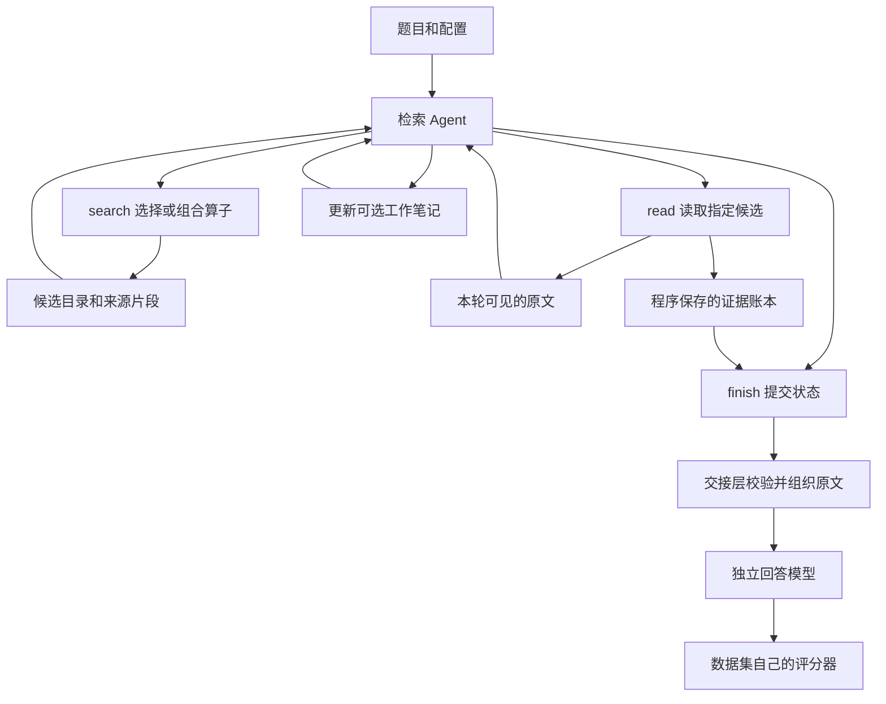

# 03 · Agent 怎样检索，证据怎样到达回答模型

本章核对的是 `v1.0.0` 发布源码。这里的 Agent 专门负责找资料；最终回答由另一个阶段完成。它们可以使用同一款模型，但不是同一次对话，也不共享完整工具历史。

理解这套设计，只需先分清三样东西：**候选是找资料的线索，working memory 是模型自己的进度笔记，evidence 是程序保存的原文证据。** 三者不能互相替代。笔记写了一个结论，并不代表程序已经读到支持它的原文；搜索返回了一个相关 parent，也不代表 Agent 已经看见其中每一句话。

## 1. 一道题的完整工作过程

[`runPicorer`](../../src/evidence-agent/adapters/pi/run-agent.ts) 为每道题创建一个新的 Agent、`MemoryLedger`、算子目录副本和轨迹数组。上一道题的候选、工作笔记和已读证据不会自然流入下一道题。

例如题目问“某人的配偶从事什么职业”。Agent 可以先查配偶，再用查到的人名查职业。模型决定该查哪条关系、哪一个候选值得读，以及是否已经够用；程序负责让选中的候选对应真实来源，保证成功保存的证据不在提交时无声消失。

这个分工有明确边界：程序能拒绝不存在的来源引用，却不能保证模型选对配偶；程序能保存旧事实和新事实，却不会凭空知道哪一个编号代表最新事实。`finish(status="sufficient")` 是模型对证据充足程度的判断，不能直接当成证据链完整的证明。

## 2. 三个独立开关，不要混在一起

| 配置 | 控制什么 | 不代表什么 |
|---|---|---|
| `interfaceMode`，评测 YAML 常写为 `interface_mode` | `full` 或 `compact`，影响工具参数、候选呈现、局部 passage 投影及默认上下文策略 | 不是版本号，不是检索后端 |
| `contextPolicy` | 工具历史怎样离开活动上下文，笔记怎样维护 | `full` 不等于保留全部原文历史 |
| `skill` | 加载哪份检索使用说明和基础 prompt | 不直接决定底层索引；接口可以显式覆盖 |
| 算子实验 `mode` | `static`、`ephemeral`、`cumulative` 控制声明式算子定义的实验生命周期 | `static` 不等于“没有 Agent”，也不等于 `compact` |

默认规则在 `runPicorer` 中：`skill` 默认是 `picorer-v0`；未指定接口时，`picorer-minimal` 对应 `compact`，其他 skill 对应 `full`。`compact` 未指定上下文策略时使用 `working-memory-rewrite`；`full` 则使用当前窗口的上下文处理。源码中 full 默认的 `contextPolicy` 可以仍是 `undefined`，其实际处理器是 `createEphemeralMemoryContext`；显式写 `current-window` 也会选择这个处理器。显式指定其他 `contextPolicy` 可以改变这些默认值。

因此，复现实验至少要记录版本、接口、上下文策略和 skill。只写“v1.0.0”不足以说明模型实际看到了什么。

## 3. full 与 compact 的准确区别

下表比较两种接口的默认组合。若给 `full` 显式配置 `working-memory-rewrite`，其历史处理就按重写策略执行，不能再照搬 full 默认列。

| 项目 | full 默认组合 | compact 默认组合 |
|---|---|---|
| 工作笔记 | 有。`search`、`search_more`、`read` 可以携带可选文本笔记 | 有。上下文包装器向各工具加入可选文本笔记 |
| 笔记上限 | 1600 个 JavaScript 字符 | 同样为 1600 个 JavaScript 字符 |
| 搜索参数与算子组合 | 完整 `search` 参数，支持行内分支 | 同样支持，不是只能传一条 query |
| 当前候选 | 最多 20 个主要候选，passage 存在时保留其文本；parent 预览另有长度约束 | 当前页通常最多 20 个候选，按查询聚焦到约 280 字符的展示预算 |
| 同次搜索后续候选 | 从候选池生成短目录，已有 C 引用可直接读 | 后续页主要经 `search_more` 展开 |
| 较早未读候选 | 与同次搜索目录共享最多 80 条目录位置，超出只省略展示，已有引用仍有效 | 保留最多 8 条较早未读候选的短条目；不是完全删除旧候选 |
| 已读来源的持续提示 | `<MEMORY>` 中保留 E 引用、对应 C 引用、角色和时间等回执 | 重写上下文额外注入 `<READ_SOURCES>`，带 C 引用和已读原文的短摘录；不是只有已读数量 |
| 旧工具结果 | 旧成功搜索和 read 正文替换为占位说明；原助手消息和其他历史仍保留 | 下一次成功动作后移除已消费工具结果，以及对应旧动作和助手文本；保留用户消息、最新笔记、未消费结果与读取回执 |
| parent 的局部 passage 投影 | 不强制额外开启此投影；检索算子本身仍可返回 passage | `createSearchMemory` 收到 `passageProjection: true`，可依据 parent 内的局部信号生成带坐标片段 |
| 一次 `read` 的候选数 | 最多 100 个引用 | 最多 6 个引用 |
| 同会话相邻记录 | 默认前后各 1 条；分别可设为 0 至 10 | 固定为 0，不扩展相邻记录 |
| 单次 read 的内容预算 | `64 * 1024` 个 JavaScript 字符 | `128 * 1024` 个 JavaScript 字符 |
| `finish` | `status` 和可选 `evidenceSummary` | 原生 schema 只有 `status`；默认重写包装器另外加入可选笔记 |
| `bash_ro` | 提供绑定时可用 | 不提供 |
| `define_operator` | 有定义额度才提供 | 同样由额度决定 |

这里有两个容易误读的名字。首先，compact 的 read 批次额度反而更大，它“紧凑”主要体现在候选视图和历史维护，不能理解成每一项限制都更小。其次，`interfaceMode` 确实会启用额外 passage 投影，因此它也不是纯粹删几行展示文字的开关。

相关实现是 [`memory-observation.ts`](../../src/evidence-agent/adapters/pi/memory-observation.ts)、[`working-memory-observation.ts`](../../src/evidence-agent/adapters/pi/working-memory-observation.ts)、[`ephemeral-context.ts`](../../src/evidence-agent/adapters/pi/ephemeral-context.ts) 和 [`rewrite-working-memory-context.ts`](../../src/evidence-agent/adapters/pi/rewrite-working-memory-context.ts)。

## 4. Agent 真正可以调用哪些工具

权威参数定义在 [`schemas.ts`](../../src/evidence-agent/adapters/pi/tools/schemas.ts)，工具组装在 [`create-tools.ts`](../../src/evidence-agent/adapters/pi/tools/create-tools.ts)。

### search：既能简单查，也能组合查

| 参数 | 作用与约束 |
|---|---|
| `queries` | 必填字符串数组，1 至 16 条；每条应提供不同检索线索 |
| `operator` | 可选算子 ID，省略则用目录默认值；传 ID，不附加 `@version` |
| `branches` | 最多 3 个额外分支；每个分支有算子和查询数组 |
| `combine` | `rrf`、`union` 或 `intersection`；无分支时不起作用 |
| `order` | 相关性、正时间顺序或逆时间顺序 |
| `maxPerSession` | 每个会话保留候选的上限，1 至 100 |
| `limit` | 当前可见页大小，1 至 20；不等于物理候选池大小 |
| `workingMemory` | 可选进度笔记；具体处理由上下文策略决定 |

同一次 `search` 可以把语义检索和精确词检索组成一个程序，不必让模型逐次调用才能合并。算子能否物理并行，要看检索执行器；Agent 的工具执行配置本身是 `sequential`，同一轮多个工具调用按顺序执行。

[`createSearchTools`](../../src/evidence-agent/adapters/pi/tools/search-tool.ts) 为一次查询维护最多 80 条的候选池。`search_more` 只把这次已经取得的后续候选展开成另一页，不重新调用检索器，也不消耗一次新的搜索额度；它仍消耗工具调用和模型回合开销。下一次新的 `search` 替换翻页游标，但不会清空账本里的旧候选。

搜索次数约束在工具入口检查。一次物理搜索抛出异常会撤回该次额度预占，以免“实际成功次数”和 observation 中的计数不一致；这不意味着失败没有时间或模型成本。查询数、分支数和搜索调用数是不同概念，实验不能只看 `maxSearchCalls` 就认为所有配置成本相同。

### define_operator：命名可复用计划

模型提交一个 ID、简短说明和最多 12 个有序步骤。步骤包括搜索、合并、排序、按会话分散、去重、截取和时间或数值标注。步骤只能引用前面的步骤，最后一步自动作为输出；模型不能借此执行任意代码或 SQL。

普通检索运行默认容纳 4 个预载或临时定义，但 benchmark 的 `static` 模式会把定义额度设为 0，此时工具根本不出现在 schema 中。**static 仍然保留 `search.branches` 的行内组合能力。** 不要把“不能新增命名计划”说成“不能自由组合现有算子”。

### read 与 finish：模型选择资料，程序管理身份

`read` 的必需参数是 `candidateRefs`，例如 `{"candidateRefs":["C3","C7"]}`。full 还接受相邻记录数量。`finish` 让模型提交 `sufficient` 或 `insufficient`，无需模型重新列一遍 memory ID、E 引用或 citation。

可选的 `bash_ro` 用于已绑定的只读来源导航，返回的发现也要经过 `read` 才成为证据。它不是绕开存储层与引用校验的任意 shell 通道。

## 5. C、E、parent 与 passage 到底是什么

[`MemoryLedger`](../../src/evidence-agent/model/ledger.ts) 是每题独立的内存账本，保存候选、发现过程、已读证据和最终提交。它不是长期数据库，也不是自动推理图谱。

| 名称 | 身份与生命周期 |
|---|---|
| `memoryId` | 不可变 parent 记录的真实身份，用于存储、证据去重和最终来源引用 |
| `candidateId` | 一条检索命中的身份；可能是 parent，也可能是其具体 passage |
| `C1`、`C2` | 本题由程序分配的候选句柄。排序变化不改号；视图省略不使它失效；下一题不能沿用 |
| `E1`、`E2` | parent 第一次成功读入账本时分配的证据句柄。一个 parent 多个 passage 可以归入同一个 E |
| `sourceContentHash` | 完整 parent 正文的哈希，绑定不可变来源 |
| `contentHash` | 当前证据投影正文的哈希；投影合并后可以变化 |
| `excerpts` | 原文片段及 `[start,end)` 坐标，坐标单位是 UTF-16，不是 token 或 UTF-8 字节 |

`recordSearchHits` 同时保存查询、算子、排名、分数、发现步骤和来源片段坐标。同一候选后续被其他查询找到，可以积累更多来源片段；不能在同一个身份下悄悄换成另一份正文。坐标也会来自已经进入账本但尚未充分展示的目录候选，因此“账本有命中坐标”不能直接计成“模型看见了该事实”。

`resolveCandidates` 严格解析 C 引用。未知引用立即报错。`sourceSpansFor` 在读取前检查来源哈希。`recordInspect` 把新的证据与已有投影合并；重叠区原文必须一致。同一 parent 的第二次读取不会直接覆盖第一次已经取得的片段。

不同 passage 的“是否已读”单独记录。读过 parent 内一个 passage，不会把同 parent 所有 passage 都标成已读。这个区别防止目录误以为 Agent 已经检查过另一个尚未展示的关系。

## 6. read 显示什么，账本保存什么

[`createReadTool`](../../src/evidence-agent/adapters/pi/tools/read-tool.ts) 先把 C 引用解析成 parent，向 store 读取 parent 和允许的同会话邻居，然后分开构造两份内容：

1. **给检索 Agent 本轮看的内容。** 若选中的是 passage，显示它对应的精确原文；若选中 parent，显示此次预算下的 parent 证据；邻居也可能随结果展示。
2. **交给证据账本的内容。** 以 parent 为单位保存。整批 parent 原文装得下时，保存完整正文；装不下时，用查询、原问题和已绑定来源坐标生成有界的原文投影。

所以“Agent 本轮看见的内容”“账本保存的内容”“最终回答输入”可能不同。检索 Agent 看了一个短 passage，回答模型仍可能收到完整 parent。分析轨迹时必须检查对应阶段，不能拿 `read` 的展示长度冒充最终证据长度。

预算规则在 [`source-evidence.ts`](../../src/evidence-agent/model/source-evidence.ts)：

| 边界 | 实现 |
|---|---|
| 单 read 批次 | full 为 65536，compact 为 131072 个 JavaScript 字符 |
| 整批 parent 能装下 | 完整保存，不受下面 8192 的回退额度限制 |
| 整批 parent 装不下 | 每条预算取 `min(8192, floor(批次额度/记录数))`，保留必须的坐标片段，再补查询聚焦内容 |
| 必须片段或省略标记装不下 | 明确拒绝 read，提示减少候选；不会把必须保留的命中位置悄悄删掉 |
| 单题证据账本 | 最多 128 个 parent，合并后的正文总长度最多 1048576 个 JavaScript 字符 |

`recordInspect` 先在临时副本里合并并检查总额度，再更新账本。如果超限，整批不保存，错误会明确告知。这里没有自动淘汰“看起来不重要”的旧证据，也没有语义压缩调用。检查重复 read 时，应查看最终账本中合并后的 `excerpts`；单次 read 的 details 主要记录该批次投影，不能仅凭后一次 details 推断前一次片段已被删除。

这些数字的单位必须写清楚。代码使用 `String.length`，不是模型 tokenizer；中文、表情和英文的 token 或字节成本不能按一个固定比例换算。128 KiB 的最终交接阈值则使用 UTF-8 字节，属于另一个边界。

## 7. working memory 如何更新，历史怎样缩短

工作笔记建议只写“已确认事实”和“缺少事实”。它是模型生成的文本，程序不把它当成原文，不用它生成新的证据来源，也不因它声明“已经找到”就自动执行 `read`。

**v1.0.0 的 full 默认接口没有强制模型每步填写 working memory。** schema 把它标为可选；prompt 的“保持笔记更新”是行为指引，模型仍可能省略。后续计划研究的“强制填写工作记忆”属于另行实验，不能倒写成这次正式发布已经具备的约束。

**full 默认当前窗口策略**把笔记放在 observation 内。工具收到 `workingMemory` 后就替换旧文本，省略则沿用；并没有独立状态模型调用。参数校验或 `recordWorkingMemory` 会拒绝空白、超限文本。工具内部先记笔记再开始检索或读取，因此某些后续动作失败时，笔记可能已经更新。默认策略的最终 `PicorerResult` 不额外导出结构化 `workingMemory` 快照，但文本仍能从工具参数与 observation 轨迹核对。没有这个结果字段，不能推断 Agent 没有使用笔记。

`createEphemeralMemoryContext` 保留当前工具批次的完整结果，让模型有一次机会看见每个 read；后续成功工具正文变成占位说明，原文仍在审计和账本里。这个策略不等于保留全部工具历史，也不等于把所有旧助手文字清空。

**`working-memory-rewrite` 策略**使用 [`RewriteWorkingMemory`](../../src/evidence-agent/model/rewrite-working-memory.ts)，维护当前文本、修订号和前后文本审计。省略或 `null` 表示不变；字符串表示替换。执行包装器先完成原动作，再提交有效笔记。过长或空笔记不会阻止已成功的动作，而是保留旧笔记并提示；原动作抛错时不更新笔记、不消费此前可见结果。

下一轮输入重新组织为用户消息、当前笔记、已读来源短回执，以及尚未被成功动作消费的工具结果。旧笔记修订只在审计里，不回放给模型。当前代码还保留 `working-memory-v2` 增量条目和 `working-memory-v3` 进度结构的可选分支，但它们不是 full 的默认语义，更不能把历史实验草案中设想的依赖失效机制写成当前默认能力。

## 8. finish 的门槛究竟有多高

[`createFinishTool`](../../src/evidence-agent/adapters/pi/tools/finish-tool.ts) 读取整个已读账本，程序生成 citations 后交给 `MemoryLedger.finish`。所有成功保存的来源都提交，模型不再另选一个子集。

这消除了“读过但提交时漏选”的一个工程环节，也意味着读入的不相关来源和冲突版本会一并交付。当前版本没有让 Agent 在 finish 时删除这些已读来源；后续回答仍需分辨它们的作用。

它主要拒绝以下工程错误：

- `finish` 与其他工具放在同一助手批次；其他工具可能已执行，但本次 finish 被阻止。
- 声称 `sufficient`，却没有任何已读证据。
- 来源引用不属于本题的已读账本、出现重复或漏交已读来源。
- 已经接受过一种提交，又试图提交不同内容。

`insufficient` 可以没有证据。程序没有要求必须凑齐若干跳，也不会根据 gold evidence 判定是否允许结束。prompt 要求看完上一轮结果再 finish；运行时直接检查的是 finish 独占批次及账本约束，不是替模型证明它理解了上一轮原文。

连续两次 finish 失败且中间没有成功工具动作，会终止纠错循环。成功的非 finish 动作会重置这项计数，但总回合、工具次数和运行超时仍然约束整个任务。自由文本“答案”不会被当作成功输出；必须存在已接受的 finish。

## 9. 最终回答收到什么

要区分仓库中的两个接入路径。

**内置 MemoryAgentBench 路径**由 [`buildMemoryAgentBenchAnswerPrompt`](../../src/benchmark/memoryagentbench/answer-contract.ts) 检查问题、scope、证据与 citations 一致，再把账本中的证据正文组织成 `<memory>`。它沿用任务对应的回答说明，不传检索阶段的工作笔记、自由文本总结或 `sufficient` 状态。

**公共 MemoryArena API 的 `evidence-aware-v1` 路径**由 [`MemoryArenaPublicMemoryBackend.wrap`](../../src/benchmark/memoryarena-public/use-cases/memory-backend.ts) 重新读取原 parent，核对长度、哈希和片段内容，再尝试扩大交接：若全部完整 parent 加上问题和包装后的 prompt 不超过 **128 KiB UTF-8**，一并交付完整 parent；否则保持原已提交 exact excerpts。它不会为了凑到 128 KiB 再截断已经提交的证据，因此投影包本身超过阈值也可能原样保留。阈值是“是否扩展完整 parent”的判断，不是保证最终 prompt 永不超限的万能限制。

公共 API 另外保留普通 `renderMemoryArenaPublicPrompt` 路径，直接包装完整 chunks。复现实验时还应记录 `answer_handoff`，不能只看 Agent 接口模式。

两条证据交接都不把 working memory 或 evidenceSummary 当成回答依据。回答输入保留原文、角色、时间和来源元数据，去掉搜索排名、候选目录及工具轨迹；但仍含 memory ID 等来源字段，因此称为“较干净的证据输入”准确，称为“完全没有内部元数据的纯文本”不准确。

[`runBenchmarkAnswer`](../../src/benchmark/adapters/pi/answer.ts) 单独创建不带工具的 Agent，以 benchmark prompt 生成答案，检查超时、空文本、服务端错误和返回模型是否匹配。它不会拿检索 Agent 的随口回答替代失败的回答阶段。

## 10. prompt、skill、运行约束各负责哪一层

[`picorerSystemPrompt`](../../src/evidence-agent/adapters/pi/retrieval-prompt.ts) 组合基础职责说明、实时算子目录和选定 skill；若启用工作记忆策略，还追加该策略的使用说明。

- 基础 prompt 说明“只检索，不回答”、候选与证据的区别和 finish 协议。
- [完整检索 skill](../../.agents/skills/picorer-retrieval/SKILL.md) 说明何时组合算子、何时翻页、怎样选择有用来源，以及如何维护事实和缺口。
- [轻量 skill](../../.agents/skills/picorer-retrieval-minimal/SKILL.md) 提供另一套更简短的行为指引。
- 工具 schema 描述模型能提交的参数，执行器和 ledger 负责真正约束身份、范围与额度。

skill 名称带 `minimal` 不意味着没有算子使用说明。相反，维护时要让 prompt、schema 与执行行为一致，否则文案里一个“已经读过”或“可以直接引用”的误导就可能改变后续策略。

仓库还有 [`InteractiveMemoryAgentSession`](../../src/agent-runtime/interactive-memory-agent.ts)，用于带外部业务工具的持续会话。它复用候选账本和内存工具，但没有本章 benchmark 的 finish 回答交接；外部工具调用交给调用方执行，结果回来后继续会话。它强制记忆工具与业务动作分批，并校验待返回工具 ID。不能把这个持续会话 API 与“一题一 Agent”的离线检索运行混成同一个生命周期。

## 11. 维护时最值得检查的边界

这套实现应保证来源工程的可靠性，而不是预先宣称解决了多跳推理。一次失败可以按下面顺序定位：

| 现象 | 首先检查的代码与证据 |
|---|---|
| 候选找到了，模型没读 | 对照当时实际模型输入，而非只看 ledger 总候选；检查当前页、旧目录、短片段和上下文策略 |
| 读了 parent，但 Agent 没见到目标句 | 区分 passage 展示与 parent 保存；检查 `READ_RESULT` 中实际文本及坐标 |
| 成功 read 的句子在回答输入消失 | 检查合并后的 `excerpts`、finish citations，以及交接层实际生成的 prompt |
| 笔记说已经确认，原文却没有 | 检查模型是否把 preview 或现实常识写成事实；笔记自身不是读取证明 |
| read 总失败 | 核对批次额度、来源片段最低需求及账本总额度；不要先归咎于模型 |
| 模型提前结束 | 先排除工具、预算、上下文与来源传递错误，再分析模型是否误判足够 |

`runPicorer` 默认限制为 16 回合、40 次工具调用、120 秒和最多 2 次协议提醒，实际服务配置可以覆盖。失败会携带已有候选、证据、工具轨迹、usage 和错误类别，便于阶段化恢复与审计。这些运行保护不会自动证明返回结果正确。

本章最重要的阅读原则是：**每个阶段都看真实输入和输出。** “搜到过”“读过”“送到回答模型”是三个不同事实。只有把这三个事实逐一核对清楚，才能区分工具工程问题与模型的检索策略问题。
