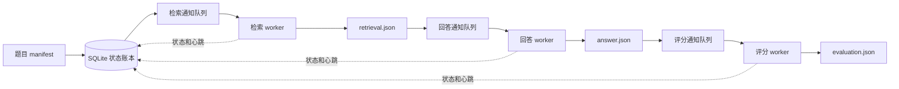

# 04 · 测评框架：让一道题独立完成，也能独立查账

这套评测框架的基本单位是一道题。某道题完成检索，就立刻进入回答；完成回答，就立刻进入评分。它不必等同一数据集的其他题，也不会因为另一道题失败而重做已经完成的工作。

这解决的是实验如何可靠地跑完、如何保留可复查记录。它不会替 Picorer 判断应该搜什么，也不会把错误答案变成正确答案。

## 1. 先分清四份代码

项目中同时存在产品、数据适配和调度三类逻辑。使用指南如果把它们混成“v1.0.0 自带的评测”，读者从 GitHub 克隆以后就会找不到命令。

| 组成 | 负责的事情 | 本次审计的边界 |
|---|---|---|
| Picorer v1.0.0 | 入库、检索、Agent 工具交互、证据交付 | 首次独立公开 tag `v1.0.0` |
| MemoryAgentBench 适配器 | 读任务、格式化问题、调用 Picorer、回答、按任务评分 | 正式 tag 含一份适配器；本轮服务器使用的 `adapter-candidate` 有额外任务与协议扩展 |
| OmniMemEval | BEAM 和 LoCoMo 的数据组织、客户端、答案与评分协议 | 独立工程，由流水线导入它的 Python 模块 |
| 单题流水线 | 排队、并发、阶段状态、重试、导出 | 服务器独立目录 `question-pipeline-v2`，不属于 Picorer v1.0.0 tag |

流水线的 `release.json` 自称 `question-pipeline-v2.1.0`，但 `pyproject.toml` 中的 Python 包版本仍是 `0.1.0`。因此复现时应保存源码文件哈希，不能只写 Python 包版本。本次发布源码与服务器源码的逐文件比较也已单独保留：产品的 `src` 与 `.agents` 相同，差异集中在 MemoryAgentBench 集成目录。产品版本一致，不意味着适配器、实验配置和数据清单也一致。

`full` 与 `compact` 属于 Picorer 服务的 Agent 交互配置。流水线不会根据实验目录名或 `v1.0.0` 字样自动选择它。两次实验是否相同，必须检查实际服务配置与回答配置。

## 2. 一道题怎样流动

图中的三个队列用 Redis Streams 传递题目 ID。大段原文、答案和轨迹保存在磁盘文件中，SQLite 保存文件位置与阶段状态。

| 阶段 | 输入 | 做什么 | 主要产物 |
|---|---|---|---|
| retrieval | 问题、已入库用户 ID、检索配置 | 调用 Picorer，让 Agent 搜索和读取 | MAB 的 `wrapped_prompt` 与 `operator_experiment`，或 Omni 的 `search_record` |
| answer | 已保存的检索产物、回答模型与 prompt | 生成最终答案；不重新搜索 | MAB 的 `prediction`，或 Omni 的 `response_record` |
| evaluation | 已保存的答案、标准答案与评分协议 | 确定性计算，或调用裁判 | `metrics` 和可用的裁判原始输出 |

MAB 的 `wrapped_prompt` 已经包含交给回答模型的证据。Omni 的 `search_record` 保存检索上下文，由 BEAM 或 LoCoMo 的回答 prompt 再组装。不要把两者都当成同一种 JSON schema。

这种设计属于**按题调度的三级生产者消费者流水线**。每个阶段有独立进程，进程内用线程池并发执行同步网络调用。它是阶段之间异步流动，不是每一道题使用一条贯穿全部阶段的异步协程。

旧设计把一个数据集的一整个阶段作为任务，检索进程不结束，回答阶段就无法启动。现在取消了这道整批等待，并把“每完成一题就重写整套结果文件”改成“每题每阶段写一个文件”。这两项比单纯增加线程数更有实际作用。

## 3. 为什么同时使用 SQLite 和 Redis

SQLite 回答“事实是什么”：这题的检索完成了吗，用了几次尝试，产物在哪里。Redis 回答“哪个 worker 现在可以看一眼这题”。即使通知被重复发送，worker 也必须先向 SQLite 认领任务，不能拿到消息就直接调用模型。

`state.py` 建立三张表：

| 表 | 保存内容 | 重要约束 |
|---|---|---|
| `questions` | 全局题目 ID、benchmark、adapter、排序、payload、payload 哈希 | ID 唯一；相同 ID 的问题配置变化会被拒绝 |
| `question_stages` | 各阶段状态、尝试次数、worker、心跳、时间、错误、产物路径与哈希 | 一题一阶段只有一行 |
| `events` | 初始化、排队、开始、重试、完成、迁移、租约恢复 | 保留发生顺序，不能只看最后一次状态 |

写状态时使用 `BEGIN IMMEDIATE`，认领操作只允许把 `queued` 改成 `running`。两个 worker 同时收到同一题，正常情况下只有一个能改成功；另一个确认通知后退出。数据库使用 WAL，连接启用外键和 30 秒的锁等待。

`payload_sha256` 检查的是 payload 的规范化 JSON。它能发现题目文本、用户 ID、路径字段或已绑定 eval 配置发生变化，但不能自动发现某个路径指向的文件被原地改写。尤其是服务配置、适配器源码和环境变量，需要另外冻结和记录。

### 状态不是只有成功和失败

| 状态 | 人话解释 |
|---|---|
| `blocked` | 前一步还没成功，当前阶段不能开始 |
| `ready` | 条件满足，尚未正式排队 |
| `queued` | 等 worker 认领 |
| `running` | 某个 worker 正在执行，并定期续心跳 |
| `completed` | 本阶段已成功保存产物 |
| `failed` | 本阶段结束，当前自动策略不再重试 |
| `waiting_external` | 有意等外部裁判或其他条件，不算评分完成 |
| `skipped` | 清单明确不执行这一阶段 |

`settled()` 只表示当前没有可以继续派发的工作。一个包含失败题、待裁判题的实验也可能是 settled。把它翻译成“全部成功”会误报。

## 4. 结果怎样落盘，崩溃以后怎样恢复

`Worker._process()` 的关键顺序是：

1. 在 SQLite 原子认领题目，增加当前阶段的 attempt。
2. 每 20 秒更新心跳；读取前面已完成阶段的 JSON。
3. 调用相应 adapter，得到 `StageResult`。
4. 写临时 JSON，刷入磁盘，原子替换正式文件，再刷目录。
5. 把产物路径、规范化内容哈希、耗时和完成状态写入 SQLite。
6. 把下一阶段设为 ready、queued，发送 Redis 通知。
7. 确认当前 Redis 消息。

这里先落文件、后记完成，避免数据库说成功了但文件还没写完。通知即使在 SQLite 更新之后丢失，worker 重启时也会从 SQLite 补发 queued 记录。超时没有心跳的 running 记录会被 `recover_stale()` 放回 ready。

但这不是端到端的“只执行一次”保证。模型已经返回、进程却在记录完成前崩溃，恢复后仍可能再次调用模型。心跳失效后的旧调用也可能还在服务端运行。因此应称为**重复通知下的状态去重和可恢复执行**，不能承诺外部模型调用 exactly-once。

还有三个实际边界值得明说：

- 产物使用固定的 `retrieval.json`、`answer.json`、`evaluation.json` 路径，通过原子替换写入。它不是每次尝试独立保存的不可覆盖对象库；异常重执行可能替换该阶段文件。
- SQLite 记录了产物哈希，但当前 worker 读前序 JSON 时没有自动核对该哈希。哈希是审计依据，不是每次读取都执行的完整性门禁。
- `recover_stale()` 本身不检查 `max_attempts`。普通错误重试受上限控制，反复崩溃恢复不能简单套用同一个硬上限。

这些限制不要求日常运行时不停人工干预，但决定了怎样解释实验成本和重复尝试。需要严格的请求计数时，还应保留模型端请求日志。

## 5. 并发控制真正控制了什么

Supervisor 启动 retrieval、answer、evaluation 三个 worker 进程。每个进程的线程池大小单独指定。回答队列积压达到 `max-answer-backlog` 后，检索 worker 暂停取新任务，给回答留出消化时间；已经在执行的检索不会因此被中断。

这叫背压：下游忙不过来时，上游先少生产。当前背压按**题数**计算，不按证据 token 数计算。十道短问答和十道超长 EventQA 对模型的压力可能完全不同。

框架也没有全局 GPU 容量调度器。设置 32 个检索槽位和 16 个回答槽位，不代表最多恰好 48 个模型请求：一次检索里面有多轮 Agent 调用；LoCoMo 的单题适配还可能访问两个说话者的记忆。第二个模型实例是否能分流，取决于服务和模型端点如何路由，Redis 自己不会分配显存。

调并发时应同时观察五分钟完成量、回答积压、请求排队时延、模型 KV cache 和错误率。一个阶段的活跃线程少，不一定还有 GPU 余量；全部线程忙，也不等于吞吐已经到顶。

Supervisor 用文件锁防止同一个状态库被两个 supervisor 同时接管。worker 异常退出后会有限次数重启，停止时按进程组发送信号，并留出有限清理时间。它不阻止操作者绕过 supervisor 手动启动额外 worker。

## 6. 重试政策要按阶段看

`RetryableStageError` 表示“框架允许重试”，不是“这次重试不会多消耗一次模型调用”。通用 worker 只对这种异常自动重试，按指数间隔短暂退避，超过清单上限后记录失败。

| 情况 | 当前行为 |
|---|---|
| MAB 检索明确报告可重试的过载、`append_pending`、`upstream_unavailable` | 允许重试 |
| MAB 检索返回 422 `retrieval_agent_protocol_error` | 当前补丁允许重试；这是重新运行随机 Agent，应计入方法与成本 |
| Omni 检索返回 429，或指定的可重试服务错误 | 允许重试 |
| 检索连接中断，无法确认服务是否已经完成 | 通常记录失败，避免无声重采样 |
| 回答阶段的连接错误、限流或部分服务端错误 | 从原有检索产物重试回答，不重新检索 |
| 裁判返回无法解析的 JSON 或标签 | 对应裁判实现可抛出可重试异常 |
| 明确设为 `deferred` 的裁判 | 写 waiting_external，自动重试不会使它继续 |

MAB 的 Qwen 空回答另有一条适配器内部策略：在启用思考时返回空 content，可对**同一份处理后的证据输入**补发一次 `reasoning_effort: none` 的回答请求。它不会把 reasoning 文本冒充最终答案。若补发后仍为空，当前 `ChatClient` 报不可重试的 empty completion。

这一补发发生在一个 answer attempt 内。SQLite 的 attempt 数不等于 HTTP 请求数；设置 `MAB_ANSWER_FALLBACK_AUDIT` 后还需检查额外的 fallback 审计日志。Omni 的行为不同：绑定 eval YAML 后，空回答作为阶段可重试错误处理；未绑定时直接报错。不能给所有数据集概括一个相同的空回答兜底策略。

## 7. 两类 benchmark 怎样接进来

MAB manifest 读取任务配置和数据集，找到每个 context 已入库的 user ID，展开成问题。题目 ID 包含任务、context 和原 QA ID。生成清单时缺少入库 checkpoint 会报错，而不会悄悄改用空库。问题 payload 中保存标准答案供评分使用；检索请求只取格式化问题和 user ID，不把 gold 当成检索条件。

Omni manifest 从 BEAM 的 `probing_questions` 和 LoCoMo 的 `qa` 展开问题。BEAM 保留 scale、dimension、rubric 和 conversation ID。LoCoMo 按两个 speaker 的用户空间查询，并在回答前去掉共享的重复上下文。当前清单生成器明确跳过 LoCoMo category 5。

BEAM、LoCoMo 的公开 user ID 带 service version，实际复用的入库版本另有 `ingestion_version`。负责映射的是运行中的 Picorer 集成服务。清单记下了两者，但不能因为字段存在，就认为任何服务都已实现并验证了这层映射。

### 本轮“全量”的准确含义

2026 年 9 月 11 日核对主状态库，题目清单为下表。它描述本轮已选择的 4,211 题，不宣称涵盖原论文所有数据版本或所有附录实验。

| 接入路径 | 数据集 | 题数 |
|---|---|---:|
| MemoryAgentBench | Fact-MH 262K | 100 |
| MemoryAgentBench | Fact-SH 262K | 100 |
| MemoryAgentBench | EventQA Full | 500 |
| MemoryAgentBench | Recom.（ReDial 电影推荐） | 200 |
| MemoryAgentBench | LongMemEval-S | 300 |
| MemoryAgentBench | InfBench Sum | 100 |
| MemoryAgentBench | DetectiveQA | 71 |
| MemoryAgentBench | Banking77、Clinic150、NLU | 各 100 |
| MemoryAgentBench | TREC Coarse、TREC Fine | 各 100 |
| MemoryAgentBench | Ruler QA1、Ruler QA2 | 各 100 |
| OmniMemEval | BEAM 100K | 400 |
| OmniMemEval | BEAM 10M | 200 |
| OmniMemEval | LoCoMo，排除 category 5 | 1,540 |
| **合计** | MAB 2,071，Omni 2,140 | **4,211** |

### 分数要读对

Fact-MH 和 Fact-SH 的主指标是 `substring_exact_match`，另有 `exact_match`、F1 等辅助字段。分数来自当前任务评分代码，不是额外调用 LLM 裁判。

**与论文主表对齐：这里的 ReDial 就是 TTL 栏下的 Recom.（Recommendation，电影推荐）。** 论文 Table 6 将它写为 `Movie-Rec Redial`；官方数据源为 `recsys_redial_full`，我们的任务 ID 为 `recsys-redial-full`。这几种名称对应同一项评测，论文规模为一份约 1.44M token 的共享语料、200 道题。[论文主表与数据说明](https://arxiv.org/html/2507.05257v4)、[官方任务配置](https://github.com/HUST-AI-HYZ/MemoryAgentBench/blob/fe1735de8cf8b9908e1e3d3b5612afc815698062/configs/data_conf/Test_Time_Learning/Recsys/Recsys_redial_full.yaml)。

这项任务先提供大量电影推荐对话作为历史样例，再给一段新的用户对话，要求输出按顺序排列的 20 部推荐电影。主指标只考察前五项对标准电影的覆盖程度。它用于考察根据历史样例进行推荐的测试时学习能力。本次“全量”指 MemoryAgentBench 改编后的 200 题全部运行。

Recom.（ReDial）的 Recall@5 衡量**最终答案推荐的前五部电影覆盖了多少标准电影**。当前适配器解析推荐文本，把电影名映射到固定电影目录，计算 gold 电影在前五项中的覆盖率；它也输出 Recall@1 和 Recall@10。这个指标不是 Picorer 检索候选的 Recall@5。推荐格式、名称清洗、电影目录版本和近似匹配逻辑都属于评分协议，应和答案一同固定。

BEAM 按 rubric 逐项评分，event ordering 单独计算顺序与覆盖；LoCoMo 使用配置的二元裁判；LongMemEval 按问题类型选裁判 prompt；InfBench Sum 使用 fluency、recall、precision 三次判断，再计算带 fluency 权重的 F1。代码字段名 `official_score` 只是统一汇总入口，不足以证明任意 prompt 和模型组合都符合官方设置。

## 8. eval YAML 从哪里真正生效

`eval_config.py` 的 schema 有 `models`、`prompts`、`datasets` 三层。生成 manifest 时显式传 `--eval-config`，才会在每题 payload 加入配置绝对路径、文件 SHA-256 和 dataset key。worker 使用前核对文件哈希，发现变更就拒绝混用。

**没有这个绑定的旧 manifest，仍然使用旧配置路径。** 仅创建或修改 `config/eval.yaml` 不会切换正在运行的实验。当前主流水线中已核查的 Fact-MH payload 未绑定 eval YAML，因此应按它指向的 MAB config 解释回答参数。

这里还有几项已核对的实现范围：

- `native` 的实际指标由 MAB `TaskConfig` 和 `score_prediction()` 决定；YAML 的 `judge.metric` 当前是说明字段，不会动态改评分函数。
- MAB adapter 实际分派 `longmemeval`、`infbench`、`deferred`，其余走原生评分。不要给它配置 `binary` 并期待二元裁判，仅通过通用 schema 校验还不够。
- Omni adapter 实际支持 `binary`、`beam`、`deferred`。Omni 回答当前读取 prompt 的 `user`；自定义 `system` 没有传入回答调用，应把必要回答指令写在 user 模板里。裁判的 system 则会传递。
- 模型端点来自环境变量时，配置哈希只固定变量名，不能固定变量当天指向哪个服务。请求参数和响应模型标识仍需记录。
- 三阶段在产物上解耦，但 MAB adapter 的阶段入口目前仍初始化 memory client 并检查运行时身份，包括评分阶段。直接运行 pipeline 的 MAB eval 仍可能依赖 Picorer 服务可访问。

## 9. 导出和报表不能抹平未完成项

`mab_export.py` 按任务导出与原适配器接近的 JSON，保留答案、指标和 `operator_experiment`。它只纳入已经回答完成的题，并且每个指标按有值的题求平均。因此报表必须同时展示目标题数、回答完成数和评分完成数，不能把部分题的均分写成全量成绩。

`omni_export.py` 导出 BEAM、LoCoMo 的 search 和 responses 文件，供后续评分或排查。它当前不导出 pipeline 的 evaluation artifact；裁判结果仍需从状态库与对应文件读取。Supervisor 只在运行 settled 后自动导出，想看中途结果可显式执行导出命令。

完整审计最少需要：服务源码与配置、适配器版本、manifest、eval YAML 及哈希、SQLite 账本、阶段产物、服务端检索轨迹、fallback 日志、裁判原始输出。只留下一个总分 JSON，不足以回答“掉分发生在检索、回答，还是评测”。

## 源码阅读入口

以下快照保留了本章引用的实际实现，可按职责阅读，而不必先通读所有文件。

| 问题 | 入口 |
|---|---|
| 状态如何变化 | [state.py](<./_audit/pipeline/question_pipeline/state.py>)：`initialize`、`claim`、`complete`、`recover_stale` |
| 单题如何执行 | [runtime.py](<./_audit/pipeline/question_pipeline/runtime.py>)：`Worker._process`、`Worker.run` |
| 通知与落盘 | [transport.py](<./_audit/pipeline/question_pipeline/transport.py>)、`artifacts.py` |
| 如何管理进程 | [supervisor.py](<./_audit/pipeline/question_pipeline/supervisor.py>) |
| 配置如何绑定 | [eval_config.py](<./_audit/pipeline/question_pipeline/eval_config.py>)、`mab_manifest.py`、`omni_manifest.py` |
| 具体数据怎么跑 | [memoryagentbench.py](<./_audit/pipeline/question_pipeline/adapters/memoryagentbench.py>)、`omnimemeval.py` |
| 评分与导出 | [infbench_judge.py](<./_audit/pipeline/question_pipeline/infbench_judge.py>)、`omni_judges.py`、`mab_export.py`、`omni_export.py` |
| ReDial 与空回答策略 | [scoring.py](<./_audit/adapter-candidate/mab_adapter/scoring.py>)、`clients.py` |

链接指向文档目录下的 `_audit` 审计快照；它们用于核对实现，不是另一个需要部署的 Picorer 工作区。
