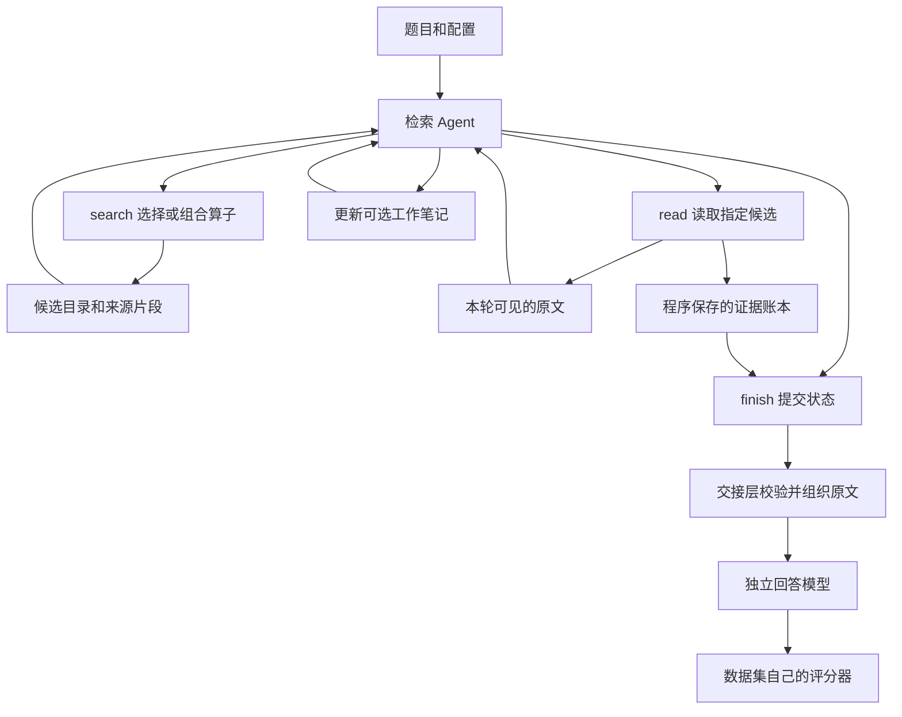
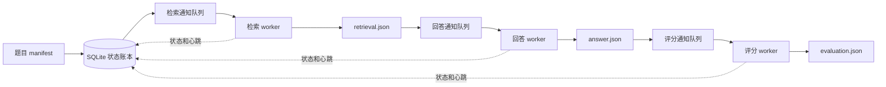

# Picorer v1.0.0：系统设计、实现细节与评测使用指南

这是一份可以连续阅读的完整指南，系统设计、模块实现、配置示例和操作命令都放在同一个文件中。

这份文档讲清三个问题：Picorer 怎样保存和检索资料，Agent 怎样使用工具并交付原文，以及如何用当前评测系统稳定运行和复现实验。

本文以 **v1.0.0 正式发布代码**为产品依据，不把后续实验开关混入正式版本。关键说法都链接到对应源码。需要检查全部文件时，可直接查看随文保存的源码和校验清单。

## 目录

| 章节 | 读完应能回答的问题 |
|---|---|
| [01 · 整体系统设计](#1-整体系统设计) | 各模块怎样分工，一道题怎样走完，系统能保证什么 |
| [02 · 存储与检索](#2-存储入库与检索) | 如何切分和入库，SQLite 与向量库怎样配合，每个算子如何实现与组合 |
| [03 · Agent 与证据](#3-agent工作记忆与证据交付) | search 看见什么，read 保存什么，working memory 如何使用，finish 怎样交接 |
| [04 · 评测框架](#4-评测框架) | retrieval、answer、evaluation 如何解耦，如何排队、重试、恢复和计分 |
| [05 · 评测使用指南](#5-评测使用指南) | 怎样配置模型和 prompt、复用入库、启动全量、续跑和查看结果 |
| [06 · 服务运行与排查](#6-服务运行与故障排查) | 怎样启动服务、核对身份、备份数据库，以及定位慢请求和失败 |
| [07 · 代码导航与维护](#7-代码导航与维护) | 改一个行为应该进入哪些文件，相关测试应验证什么 |
| [08 · 正式全量测评结果](#8-正式全量测评结果) | 四个模型的正式分数、小分、实验设置和结果解读 |

目录中的链接只在本文内跳转。第一次了解项目，按章节顺序阅读。需要立即运行评测，先读第 05 章，再核对第 06 章中的服务与数据身份。排查“搜到却没交付”的问题，直接看第 03 章。

## 版本与源码依据

| 对象 | 位置和身份 |
|---|---|
| 正式 Picorer | [GitHub v1.0.0](https://github.com/fendss/picorer/tree/v1.0.0)，Picorer 的首次独立公开版本 |
| 产品源码 | [仓库根目录](../../)，`RELEASE_MANIFEST.json` 记录 v1.0.0 的发布边界与校验状态 |
| 当前 full 评测使用的产品快照 | 236 服务器 `/data/zhaogangyi/picorer-eval/qwen36-v100-full-queue-20260911/source` |
| 测评队列工程 | 236 服务器 `/data/zhaogangyi/picorer-eval/queue-infra/question-pipeline-v2`；部署声明版本 `question-pipeline-v2.1.0` |
| 当前扩展 adapter | 236 服务器 `/data/zhaogangyi/picorer-eval/qwen36-v100-full-queue-20260911/adapter-candidate` |
| 核验文件 | [RELEASE_MANIFEST.json](RELEASE_MANIFEST.json)、[发布源码与运行快照对比](_audit/release-vs-running-source.json) |

核对日期：2026 年 9 月 11 日。正式标签与上述运行快照逐文件比较，373 个文件中 14 个不同，均在 `integrations/memoryagentbench`；`src` 和 `.agents` 与标签相同。因此可以说该 full 运行使用 v1.0.0 产品实现，但不能说整个评测环境未经修改。

三阶段队列和扩展 adapter 不属于该正式标签。仅克隆 Picorer 仓库，并不会自动得到当前服务器上完整的队列部署。随文的 [`_audit/pipeline`](_audit/pipeline) 和 [`_audit/adapter-candidate`](_audit/adapter-candidate) 用于核对这两部分实现，不能替代模型、数据及数据库的部署准备。


## 文档的使用边界

本文解释实际实现，也明确记录限制。例如 branches 当前按步骤执行，不是自动并行的查询图；finish 校验来源和提交协议，不判断推理链必然完整；队列可以恢复任务，但并不保证外部模型请求恰好执行一次。

后续的强制工作笔记实验独立记录在 [实验说明](../../experiments/full-required-working-memory-20260911/EXPERIMENT.md)。它不改变本文介绍的正式 v1.0.0 默认行为。本文保留正式版本的工程说明；后续实验成绩单独记录。

---

## 1 整体系统设计

Picorer 把“找到能回答问题的资料”作为一个独立任务。原始资料先进入存储；收到问题后，检索 Agent 决定搜索什么、读什么；程序保存读到的原文；另一个回答请求使用这些原文作答。评测框架再按数据集规则评分。

这种拆分使我们能分别检查：资料是否入库、工具是否找到相关记录、Agent 是否读了它、交接是否保留原文、回答模型是否正确使用了原文。一个低分不应直接归因于其中任一环节。

产品源码、运行快照及独立评测工程的身份，统一列在本文开头的[版本与源码依据](#版本与源码依据)。

### 1.1 系统由谁负责什么

| 部分 | 输入 | 输出 | 负责的判断 |
|---|---|---|---|
| 数据集 adapter | 数据集原始语料、题目与元数据 | 带来源信息的存储记录、独立题目 | 语料怎样对应会话和记录；不把 gold 答案送入检索 |
| memory 与 SQLite | 记录、scope、会话身份 | 原文、稳定 ID、内容 hash、可查询索引 | 原文保存、作用域隔离、重复写入一致性 |
| retrieval | 查询、算子及组合参数 | 排序后的候选、可选 passage、来源坐标 | 有限检索、融合、过滤、排序与定位 |
| evidence-agent | 问题、工具结果、可选工作笔记 | 证据账本、结束状态、完整工具轨迹 | 模型选择下一步；程序校验工具和引用 |
| 回答交接 | 已读原文与用户问题 | 回答模型真正接收的 messages | 检查来源、组织文本、限制大小 |
| 回答阶段 | 问题和证据 | 最终答案 | 使用已有证据回答 |
| 评测阶段 | 答案、金标准、评分配置 | 单题指标与汇总 | 按 benchmark 协议比较结果 |

同一款 Qwen 可以同时承担检索和回答，但二者是独立请求。检索的中间思考不会因为使用同一个模型而自动进入回答请求。

### 1.2 一道题怎样走完

以“某人的配偶从事什么职业”为例。入库阶段保存包含人物关系与职业的原始记录，生成词法索引以及所配置的向量索引。问题到来后，程序创建本题独立的 Agent 和证据账本。

Agent 首先调用 `search`。它可以选择一个算子，也可以在一次调用中提交多个检索分支。工具返回候选引用和相关文本，而不是替 Agent 做出最终判断。Agent 选中候选后调用 `read`。程序把引用解析回当前作用域内的真实记录，读取原文和允许的邻近记录，保存来源坐标。读出的文本同时进入工具结果，供模型决定下一步。

假如第一条资料只说明配偶姓名，Agent 还需要用这个姓名查职业。工作笔记可以记录已知姓名和缺失职业，但笔记不是原文证据。查询里的中间实体由模型选择；程序不会从上一跳答案自动生成下一跳查询。

Agent 调用 `finish` 时，程序提交已读来源。最终交接层再次校验来源，条件允许时交付完整 parent；总预算装不下完整展开时，使用已保存的精确片段。回答阶段还可能受模型上下文预算约束，因此分析“答案是否得到支持”必须检查真正发送的回答输入，不能只检查 read 日志。

这一过程的实现集中在 [run-agent.ts](../../src/evidence-agent/adapters/pi/run-agent.ts)、[工具装配](../../src/evidence-agent/adapters/pi/tools/create-tools.ts) 和 [服务装配](../../src/benchmark/memoryarena-public/composition/create-runtime.ts)。详细机制见 [存储与检索](#2-存储入库与检索) 及 [Agent 与证据](#3-agent工作记忆与证据交付)。

### 1.3 三种容易混淆的数据

**原始记录 parent** 是持久化来源单位，带 scope、会话、顺序和 hash。它是不是一个完整事实，取决于上游数据格式和切分方式；数据库不会替我们理解自然语言边界。

**passage** 是 parent 内的一段定位文本，用来提高检索和阅读的针对性。它不必成为一个独立的永久记录，也不一定有独立向量。v1.0.0 中，超长 parent 可以分段请求 embedding，再取平均得到一个 parent 向量。因此“有细粒度 passage”不能推出“向量检索已经按细粒度句子建立索引”。

**工作笔记 workingMemory** 是模型维护的当前进度文本。它允许记错，也允许省略。full 默认不会强制更新；compact 默认使用重写笔记上下文策略，但字段同样可选。候选、工作笔记和原文账本有不同生命周期，不能把笔记里出现一个结论当作证据已交付。

### 1.4 为什么是模块化单体

产品主体是一个 TypeScript 工程。HTTP 接口、命令行、评测入口复用相同的存储、检索和证据模块，没有为每个 benchmark 各造一套 Agent。

模块按职责组织：`model` 定义数据及规则，`ports` 定义外部能力接口，`use-cases` 组织业务步骤，`adapters` 连接 SQLite、Qdrant、模型和文件，`composition` 在入口处装配具体实现。这些目录是依赖边界，不意味着每个目录都要独立部署。

例如检索模块只需要一个能搜索和读取记录的接口，不应关心一个分数是 SubEM 还是 Recall@5；证据账本只负责来源合法性，不应根据 Fact-MH 的 gold 链决定搜索动作。这样修复来源保存时，其他 benchmark 可以直接受益，而不会引入题目专用规则。

[依赖规则](../../docs/architecture/dependency-rules.md) 与 [架构测试](../../test/architecture/dependency-rules.test.ts) 是代码边界的依据。产品已有的逐文件目录可在 [代码目录](../../docs/architecture/code-catalog.md) 查阅；本文额外解释职责与运行关系。

### 1.5 配置比版本名字更具体

v1.0.0 同时包含不同检索后端、接口和上下文策略。记录“用了 v1.0.0 和 Qwen”不足以复现实验。

至少还要记录：实际源码和 adapter 校验和、数据库身份、embedding 配置、`retrieval_profile`、`skill`、`interface_mode`、上下文策略、模型路由与实际返回模型名、thinking 设置、检索次数、工具和回合限制、输出上限、回答 prompt、评分器、并发和重试。

`full` 与 `compact` 都保留算子组合。它们不仅改变显示长度，也会影响 passage 投影、读取限制和默认历史处理。`static` 则是算子定义生命周期：不让 Agent 在运行中新增持久化定义，已有算子和行内组合仍可用。三个名字控制不同事情。

目前 Fact-MH 得到 50/100 的 full 配置使用 `picorer-v0`、当前窗口策略、可选工作笔记、8 次搜索预算。本文没有把待跑的“强制工作笔记”实验写成正式版本的默认行为。

### 1.6 工程保证与研究问题的边界

代码可以保证来源引用存在、没有跨用户读取、已提交原文有对应 hash、预算超限明确报错，以及单题失败有轨迹。代码不能仅凭这些保证正确的证据链一定被发现。

同理，`sufficient` 是 Agent 自己选择的结束状态，词法和向量召回分数是排序信号，前沿饱和提示只描述使用过的查询。这些都不是“答案已经正确”的证明。

工程排查应先检查可以确定的边界：语料与数据库是否一致、读取目标是否有效、命中坐标是否保留、回答输入是否完整、请求是否成功。排除这些问题后，才讨论模型是否选择了错误实体、相信了旧事实、误判完成或无法规划下一关系。

仓库还保留增量工作记忆和跨题算子目录等实验模块。跨题目录筛选的是可复用检索计划，不是训练模型权重。它们的存在不等于当前静态评测启用了自进化。

---

## 2 存储、入库与检索

Agent 如何决定读取、维护 working memory 和提交证据，见[下一章](#3-agent工作记忆与证据交付)。

### 2.1 先分清四种东西

Picorer 的存储层保存原文，检索层给原文排顺序，Agent 决定读哪些来源，Harness 负责把真正读到的来源交付出去。理解这条分工，首先要分清以下对象。

| 对象 | 是什么 | 不应误解成什么 |
|---|---|---|
| `MemoryRecord`，也称 parent | 一条有固定 ID、来源和正文的存储记录 | 不一定是一篇完整文档，也不保证是一条语义完整的事实 |
| `MemoryPassage` | parent 正文里的连续片段，带起止位置与 parent 的内容哈希 | 不是另一次摘要，不是默认独立入库的向量记录 |
| `RetrievalHit` | 一条命中记录，附查询、排名、预览及命中来源 | 命中 parent 不等于已找到目标关系，也不等于 Agent 已读 |
| `CandidateSet` | 算子产生或加工的一组候选 | 不是最终证据包，候选融合不会自动提交原文 |

例如，一条会议记录同时写了预算、人员和发布日期。它可以是一个 parent；关于发布日期的两句话可以成为 passage；搜索结果里看到了它，仍需要 Agent 发出 `read`。最终提交完整 parent，指的是这条入库记录的完整正文，不是恢复整份会议档案。

数据模型定义在 [memory.ts](https://github.com/fendss/picorer/blob/v1.0.0/src/memory/model/memory.ts#L18)、[search.ts](https://github.com/fendss/picorer/blob/v1.0.0/src/retrieval/model/search.ts) 和 [passage.ts](https://github.com/fendss/picorer/blob/v1.0.0/src/retrieval/model/passage.ts#L12)。

### 2.2 入库：保存来源，建立索引

#### 2.2.1 核心入口不负责理解文本

`ingestMemorySessions()` 接收已经整理好的 sessions。每个 session 包含 `scopeId`、`sessionId`、可选时间、若干 turns；每个 turn 包含角色、正文、可选 ID 与元数据。

函数逐项检查 scope、重复 session、重复 memory ID、角色、时间格式及 JSON 元数据，然后把每个 turn 变成一个 `MemoryRecord`。输入有 ID 就使用该 ID；没有则根据 scope、session 和 turn 位置生成稳定 ID。正文计算 SHA-256，session 与 turn 的元数据分别保留。空正文允许保存，因为空的一轮对话也可能有来源位置。

这里没有大模型，没有摘要，也没有事实抽取。核心入库保留的是**适配器交给它的正文**。如果适配器之前做过分句、空白合并或文档切块，不能再声称数据库与数据集最初文件逐字相同。[实现：ingest-memory-sessions.ts](https://github.com/fendss/picorer/blob/v1.0.0/src/memory/ingest-memory-sessions.ts#L169)。

#### 2.2.2 parent 的边界由上游决定

Picorer 没有一个适用于所有数据集的“完整信息判断器”。聊天数据可以一轮消息一个 parent；长文数据可以先按句子聚合成块，再把块作为 parent。

仓库中的 MemoryAgentBench HTTP adapter 使用 NLTK 分句和 `gpt-4o-mini` 对应的 tokenizer，默认按约 4096 tokens 聚合句子。它用空格重新连接句子，单个超长句子不会进一步切开，所以 4096 是聚合目标，不能当作每块绝不超出的硬限制。独立的 public adapter 也有自己的 chunking 实现及固定参数。BEAM、LoCoMo 经 OmniMemEval 接入时，应查看那次实验使用的适配器，不能套用这里的 AMB 切块规则。[HTTP adapter](https://github.com/fendss/picorer/blob/v1.0.0/integrations/memoryagentbench/mab_adapter/chunking.py#L4)、[public adapter](https://github.com/fendss/picorer/blob/v1.0.0/integrations/memoryagentbench-public/hydrate.py#L135)。

因此，“保存完整 parent”解决的是后续读取和交付再次截断的问题。它不能补回入库前已经拆开的上下文，也不能保证编号与正文、主语与指代、更新与旧事实恰好落在同一块。

#### 2.2.3 SQLite 是原文与索引身份的依据

`MemoryStore` 用 Node 的同步 SQLite API，启用 WAL 与外键。主要表如下。

| 表 | 保存什么 |
|---|---|
| `memories` | 原文、memory ID、scope、session、turn、角色、时间、内容哈希、元数据 |
| `memory_fts` | FTS5 全文索引；索引文本为角色前缀和正文 |
| `memory_embeddings` | 每个 memory、每个 embedding profile 的向量，及模型、维度、内容哈希 |
| `online_memory_scopes` | 在线 scope 正在入库还是已经封存 |
| `memory_append_sessions`、`memory_append_requests` | 在线追加的位置与请求幂等状态 |
| 时间、数值及向量发布辅助表 | 可重建的索引数据、抽取版本、向量同步与发布状态 |

批量 `ingestScope()` 在一个事务里同时写原文和 FTS。相同 scope 再次导入完全一致的记录会返回 `unchanged`；内容不同则报错，要求使用新的 scope 或版本。事务按 scope 提交，不是把全部 scopes 包成一个大事务。`memory_id` 在数据库里是全局唯一的，外部传入 ID 时也必须避免跨 scope 碰撞。[表结构与事务](https://github.com/fendss/picorer/blob/v1.0.0/src/platform/sqlite/picorer-store.ts#L136)。

在线追加另走 `appendMemoryRequest()`：同一 request ID 对应同一请求内容；重复调用返回原有记录，内容冲突则拒绝。scope 封存后不可继续追加，存在尚未完成的追加请求时也不能封存。这让追加原文、补齐索引与正式开始查询有明确边界。[在线生命周期](https://github.com/fendss/picorer/blob/v1.0.0/src/platform/sqlite/picorer-store.ts#L294)。

#### 2.2.4 向量切块与 passage 是两回事

`indexScopeEmbeddings()` 只为当前 profile 缺失的记录生成向量。输入为 `role: 原文`，计算完成后按批次写回 SQLite。

默认 embedding 模型是 `text-embedding-v4`，维度 1024，每个输入块最多 2048 个 **Unicode code points**，每批默认 10 个输入。这里的 2048 不是模型 tokens。超长文本按字符均衡拆块，各块分别 embedding，然后取算术平均，最终仍然是**每个 parent 一个向量**。embedding 输入会清理少数模型特殊标记，但 SQLite 原文不受影响。

profile ID 包含 endpoint 指纹、模型、维度、输入长度、清理方式与聚合方式。配置变化会得到不同的 profile，避免把不同向量空间悄悄混用。默认请求超时 30 秒、最多重试 4 次；部署环境可覆盖这些值。[索引入口](https://github.com/fendss/picorer/blob/v1.0.0/src/retrieval/index-scope-embeddings.ts#L21)、[embedding 默认值](https://github.com/fendss/picorer/blob/v1.0.0/src/retrieval/adapters/openai/openai-compatible-embedder.ts#L274)、[长输入聚合](https://github.com/fendss/picorer/blob/v1.0.0/src/retrieval/adapters/openai/openai-compatible-embedder.ts#L411)。

### 2.3 SQLite 与 Qdrant 如何一起工作

检索 profile 选择后端；算子选择查询方式。两者不能混为一个开关。

| profile | 关键词检索 | 语义检索 | 原文来自哪里 |
|---|---|---|---|
| `fts5`，解析器默认值 | SQLite FTS5 | 不启用 | SQLite |
| `picorer-hybrid` | SQLite FTS5 | 从 SQLite 读向量，精确计算余弦相似度 | SQLite |
| `picorer-hybrid-qdrant-hnsw-v1` | SQLite FTS5 | Qdrant HNSW 近似搜索 | 按命中 ID 回查 SQLite |

所以 Qdrant 没有替代 SQLite，`hybrid` 这个算子名字也不保证一定用了向量：如果装配时选 `fts5`，它委托的 store 就只有 FTS。[装配入口](https://github.com/fendss/picorer/blob/v1.0.0/src/composition/create-retrieval-context.ts#L30)。

SQLite 精确语义检索对 scope 内符合过滤条件的全部向量计算余弦，按分数与 memory ID 排序。优点是规则直接、便于回归对照；代价是语料大时每次都要扫描和计算，且这段计算发生在同步执行路径上，不能把它当作免费的高并发搜索服务。[精确检索实现](https://github.com/fendss/picorer/blob/v1.0.0/src/retrieval/adapters/sqlite/exact-dense-retriever.ts#L35)。

Qdrant 使用显式的 generation。发布时从 SQLite 已有向量入队、同步、核验，再发布可查询的一代；不会因为 Qdrant 服务能返回结果，就认定本批语料完整。查询前检查 generation、模型、维度与 scope 覆盖数；返回后核对 point ID、内容哈希、session、角色及时间，并从 SQLite 取原文。[发布逻辑](https://github.com/fendss/picorer/blob/v1.0.0/src/composition/qdrant-retrieval.ts#L188)、[查询与来源校验](https://github.com/fendss/picorer/blob/v1.0.0/src/retrieval/adapters/qdrant/dense-retriever.ts#L118)。

同步进度写在 SQLite 的 `vector_sync_outbox`，每项有待处理、执行中、已同步三种状态，以及尝试次数和领取租约。租约到期可重新领取；向量 point ID 是确定性的，重复同步不会生成另一个来源。generation 从入库阶段进入排空、核验，最后成为 `ready`；失败另记 `failed`。这是向量索引发布队列，与后文评测框架的检索、回答队列是两套东西。[向量同步状态机](https://github.com/fendss/picorer/blob/v1.0.0/src/platform/sqlite/vector-index-state-store.ts#L67)。

默认 HNSW 参数为 `m=32`、`ef_construct=200`、查询 `ef=800`，Qdrant 请求超时 120 秒。查询还会把 `ef` 至少提高到请求条数的两倍，上限 10000。这些是代码默认值，实验必须记录实际覆盖后的值。

Qdrant 网络不可用、限流或服务端错误时，可以退回 SQLite 精确语义检索，并累计 fallback 次数。数据身份不一致、索引不完整和配置错误会直接暴露，不会被 fallback 隐藏。这条退路可能显著增加延迟，也不意味着两种排名逐题完全相同。[错误边界](https://github.com/fendss/picorer/blob/v1.0.0/src/retrieval/adapters/fallback-dense-retriever.ts#L49)。

### 2.4 五个基础检索算子分别做什么

基础目录默认注册五个算子，版本均为 `4`。注册表启动后冻结，保存 ID、版本、用途、避免场景和成本说明。`executeSearchOperator()` 统一检查取消信号、scope、passage 身份和重复命中，避免插件把别人的记忆带进当前问题。[基础算子](https://github.com/fendss/picorer/blob/v1.0.0/src/retrieval/adapters/operators/builtins.ts#L55)、[执行边界](https://github.com/fendss/picorer/blob/v1.0.0/src/retrieval/use-cases/execute-operator.ts#L19)。

#### 2.4.1 `hybrid`：兼顾措辞相似与语义相近

对每条 query，混合后端获取语义排名和词法排名，用 RRF 融合：第 r 名贡献 `1 / (60 + r)`。这里没有额外调用大模型重排，指标中的 rerank 候选数主要描述进入融合的候选规模。

每条 query 的内部发现池固定为 100，避免只改可见页大小就导致之前的排名变化。多 query 再按“最高单路分数加其他命中分数的四分之一”合并，并最多为 10 条 query 保留各自的候选覆盖。显式日期还可产生带时间过滤的检索路线，最多保留 4 个此类候选。最后才应用返回数量、排序与 session 限额。

它适合“记录里写的词与提问不同”的情况，但向量命中的是 parent，不能因此确定 parent 中具体哪句话回答了问题。[HybridRetriever.search](https://github.com/fendss/picorer/blob/v1.0.0/src/retrieval/operators/hybrid-search.ts#L141)。

#### 2.4.2 `lexical`：围绕明确的词找来源

它使用 FTS5 和 BM25 建候选，再融合三种查询计划：完整短语权重 1.2、最多六个信息词的 AND 权重 1.1、信息词 OR 权重 1。每个计划最多取 100 条；多 query 的合并同样兼顾最好排名与各路覆盖。

它适合人名、产品名、编号、引文和特殊术语。“精确文本检索”不意味着只接受整句完全匹配：OR 路线保留了较宽召回。FTS 使用 `unicode61` 分词，不能把它宣传成具备中文专用分词能力。[SqliteLexicalRetriever](https://github.com/fendss/picorer/blob/v1.0.0/src/retrieval/adapters/sqlite/lexical-retriever.ts#L40)。

#### 2.4.3 `chronological`：把找到的来源按时间排好

它仍调用配置好的检索后端，但要求按来源时间排序。时间缺失或无效的记录放在最后；时间相同则使用 session、turn 和 ID 稳定打破平局。搜索的 `order` 还支持倒序。

它没有遍历全部知识并选择“最新正确事实”，也不理解正文里的事实编号。因此在同一个 parent 内有多个更新版本，或者所有 parent 使用相同入库时间时，仅切换 chronological 不能解决版本判断。[时间比较](https://github.com/fendss/picorer/blob/v1.0.0/src/retrieval/model/source-time.ts#L52)。

#### 2.4.4 `temporal-index`：用时间索引扩展候选

先普通检索，再从问题里的显式或相对日期构造辅助检索，随后查询版本化的日期事实辅助表。扩展优先考虑目标日期与原命中、目标日期与原 session 的交集，也保留相关 session 的时间记录。候选上限 60。

抽取依靠规则处理日期表达式、来源时间及部分相对日期，不调用模型。配合 `annotate(temporal)` 可生成带原文引用和提及日期的表，但表中的日期关联不等于模型已经确认了事件关系。[数据库扩展](https://github.com/fendss/picorer/blob/v1.0.0/src/retrieval/adapters/sqlite/database-evidence-operators.ts#L166)、[时间注释](https://github.com/fendss/picorer/blob/v1.0.0/src/retrieval/operators/temporal-operator.ts#L266)。

日期与数值共用 `EvidenceFactIndex`。第一次使用时按 scope 检查缺失记录，再以 `picorer-evidence-facts-v2` 抽取版本增量建表，正文哈希不一致则报错。辅助表记录抽取位置与版本，重建这些表不需要修改原文；首次查询可能承担建表开销，不能把它全算成模型延迟。[辅助索引](https://github.com/fendss/picorer/blob/v1.0.0/src/retrieval/adapters/sqlite/evidence-fact-index.ts#L23)。

#### 2.4.5 `numeric-index`：把有用的数字找出来

先普通检索，再利用数值事实辅助表扩展同一来源、同一 session 或数字附近含 query 信息词的记录，最多保留 80 个候选。数字保留正文中的起止位置与事实索引。

`annotate(numeric)` 进一步输出数值、单位、原句、来源，并用附近措辞区分目标、累计值、当前快照和增量。实现主要覆盖有限的英文计数单位与货币表达式；输出最多 40 行，并可提供按时间得到的最新累计值或快照提示。它**没有通用求和或实体消歧算法**，提示也不能直接当成“当前问题的总数”：不同主体和单位仍需核对。[数值扩展](https://github.com/fendss/picorer/blob/v1.0.0/src/retrieval/adapters/sqlite/database-evidence-operators.ts#L291)、[抽取与注释](https://github.com/fendss/picorer/blob/v1.0.0/src/retrieval/operators/numeric-operator.ts#L132)。

### 2.5 算子怎样组合

#### 2.5.1 一次 search 可以表达多个检索路径

下面是一个普通项目记录查询，不依赖任何评测题规则：

```json
{
  "operator": "hybrid",
  "queries": ["Orion release date change"],
  "branches": [
    {"operator": "lexical", "queries": ["Orion launch postponed"]}
  ],
  "combine": "rrf",
  "maxPerSession": 3,
  "limit": 12
}
```

程序把主路径与 branches 编译成临时声明式计划，再融合、排序或分散 session。主路径之外最多 3 个 branches；每路 queries 最多 16 条。Agent 的 `limit` 是可见页大小，上限 20；下层检索 use case 允许 1 至 100，二者不能混为一个额度。

一次成功的 search 占一个 search 调用名额，但里面可以发生多路检索与多次 embedding 请求。因此“搜索最多 8 次”不是“最多 8 个物理请求”。`search_more` 只展示最近一次搜索的下一页，不重新 embedding、不重新检索。[search schema](https://github.com/fendss/picorer/blob/v1.0.0/src/evidence-agent/adapters/pi/tools/schemas.ts#L40)、[临时计划](https://github.com/fendss/picorer/blob/v1.0.0/src/retrieval/use-cases/search.ts#L98)。

#### 2.5.2 声明式步骤各自的含义

| 步骤 | 实现行为 | 使用边界 |
|---|---|---|
| `search` | 调用一个已有算子，生成候选集 | 可以给固定 queries；省略时继承本次输入 |
| `combine: union` | 各路按名次轮流取，合并重复来源 | 适合增加覆盖 |
| `combine: rrf` | 按各路名次投票，不要求原始分数可比 | 默认的多路融合 |
| `combine: intersection` | 只留下每一路都命中的相同候选身份 | 是候选 ID 交集，不是语义关系联结 |
| `sort` | 按相关分数、正序时间或倒序时间排序 | 只重排已有候选 |
| `diversify` | 按 session 轮流选，限制每组数量 | 不保证不同 session 就是独立事实 |
| `dedupe` | 正文经 Unicode、大小写、空白规范化后去重 | 不做语义去重；不会合并相近但不同的表述 |
| `limit` | 保留前若干条 | 是有损截断，顺序影响结果 |
| `annotate` | 加时间或数值的结构化注释 | 不改变原文，不自动读取或提交证据 |
| `filter` | 内部计划可按角色过滤 | Agent 当前公开 schema 不提供角色过滤 |

融合遇到同一来源会保留多条 query 路径、命中坐标与索引事实，内容哈希冲突则报错。单路变换若删掉注释来源，也会删掉相关注释；覆盖缩小时不继续暴露依赖完整集合的派生值。`combine` 不直接拼接此前的注释表，需要时应在融合后重新 annotate。[集合操作](https://github.com/fendss/picorer/blob/v1.0.0/src/retrieval/use-cases/candidate-set.ts#L17)、[来源合并](https://github.com/fendss/picorer/blob/v1.0.0/src/retrieval/model/hit-provenance.ts#L10)。

#### 2.5.3 define_operator 是有边界的计划复用

`define_operator` 给本次运行注册一个具名计划，成功后再用 `search.operator` 调用。它不执行生成的 JavaScript、不读取原文、不创建 evidence。工具只允许引用初始目录中的算子，阻止层层嵌套模型临时定义；运行结束后不会自动成为全局算子。

计划最多 12 步，其中 search 最多 4 步，每个 combine 最多 4 个输入；引用必须指向之前的步骤，禁止重复 ID、自调用、未知算子与不参与最终输出的闲置步骤。每次定义记录 hash、catalog revision 与快照。注册表的 `forkForRun()` 默认允许定义 2 个，但实际入口可以覆盖或关闭，不能仅凭类默认值判断某轮是否开放。[工具边界](https://github.com/fendss/picorer/blob/v1.0.0/src/evidence-agent/adapters/pi/tools/define-operator-tool.ts#L10)、[计划校验](https://github.com/fendss/picorer/blob/v1.0.0/src/retrieval/use-cases/operator-definition.ts#L50)。

执行器按步骤逐个 `await`，**当前没有把独立 branches 自动并行调度**。单个 hybrid 内部会并行等待多 query 和检索路线，但不能据此宣称整个组合计划并行。组合主要减少 Agent 往返、统一结果加工与审计；是否更快仍取决于实际路径成本。

它也不能把第一步找到的新实体自动插入第二步 query。声明式 search 的 queries 来自输入或固定定义；需要理解原文再决定下一跳时，仍由 Agent 读取后发起下一次动作。[执行器](https://github.com/fendss/picorer/blob/v1.0.0/src/retrieval/use-cases/compose-operator.ts#L41)。

### 2.6 命中后怎么定位原文

Agent search 的内部候选池为 80，通常每页最多显示 20；hybrid 和词法检索更内层的单 query 发现池为 100。固定内部池是为了让翻页展示同一次检索的结果，而不是用更大 limit 重跑后改变排名。[工具入口](https://github.com/fendss/picorer/blob/v1.0.0/src/evidence-agent/adapters/pi/tools/search-tool.ts#L169)。

v1.0.0 的 `full` 使用 parent 候选与围绕 query 的预览；`compact` 在存在局部线索时才投影成 passage。这一点是两种界面的实际差异，不只是 JSON 显示长短不同。[模式绑定](https://github.com/fendss/picorer/blob/v1.0.0/src/evidence-agent/adapters/pi/tools/search-tool.ts#L241)。

parent 预览默认最多 360 字符：先找 query 词聚集的位置，尽量覆盖整句；没有局部词法命中时使用正文开头和末尾。`sourcePreviewSpans()` 将已显示的逐字片段映射回原文，并最多向附近句界延伸 256 字符。无法匹配的摘要不会凭空得到原文坐标。同一句重复出现时，旧式预览只能确定性地找到一个出现位置，不能声称恢复了检索器最初命中的位置。[预览](https://github.com/fendss/picorer/blob/v1.0.0/src/util.ts#L138)、[坐标恢复](https://github.com/fendss/picorer/blob/v1.0.0/src/evidence-agent/model/source-preview-spans.ts#L54)。

passage 则直接从原文切片：目标 1200、最大 1600 个 UTF-16 代码单元，短尾句可重叠，重叠最多 240。位置不是 tokens，也不是 UTF-8 字节。其 ID 由版本、parent ID、内容哈希和起止位置共同生成；程序检查切片内容与 parent 是否一致。

定位优先级是已有命中坐标、原文引文、query 词匹配。每个 parent 最多提供两个 passage，优先让更多不同 parent 进入候选；纯语义命中而没有局部信号时继续保留 parent，避免默认选第一段造成虚假的精确性。这是一个确定性定位启发式，不能保证每次选到完整关系事实。[passage 实现](https://github.com/fendss/picorer/blob/v1.0.0/src/retrieval/model/passage.ts#L93)。

底层 `MemoryStore.read()` 按 scope 和 ID 取原文，可以带同 session 的前后 turns；存储函数默认前后均为 0，上限各 10，Agent 工具可能传入不同默认值。未知 ID 会报错。它返回 `MemoryRecord`，不会自行生成摘要或回答；后续展示裁剪、已读记录及 parent 交付由证据 Harness 负责。[存储 read](https://github.com/fendss/picorer/blob/v1.0.0/src/platform/sqlite/picorer-store.ts#L543)。

### 2.7 composition：把模块接起来，不往主循环塞业务规则

`src/composition` 是装配层，它选择依赖并管理生命周期。

| 文件 | 责任 |
|---|---|
| `ingest-memory-workspace.ts` | 打开 SQLite、入库与导出、按 profile 建向量，必要时发布 Qdrant；默认 embedding 槽位 1、速率 6 次每秒 |
| `create-retrieval-context.ts` | 选择 FTS、SQLite 精确混合或 Qdrant 混合，并返回 store、元数据和算子目录 |
| `create-search-operator-registry.ts` | 建立并冻结算子目录，也支持显式挑选基础算子 |
| `qdrant-retrieval.ts` | 解析环境参数、建立客户端、发布 generation |
| `scoped-qdrant-retrieval.ts` | 由 scope 和内容指纹生成独立 generation，合并同进程重复发布请求；发布期间 scope 变化就报错 |
| `load-search-operator-plugins.ts` | 加载受信任的本地插件模块并记录文件 hash；这是开发者扩展，不是模型随意加载代码 |
| `create-read-only-navigation.ts` | 为当前 scope 装配只读语料导航 |
| `run-question.ts` | 打开 store、加载模型、装配检索与导航、执行 Agent，最后关闭 store |

这让“换向量库”和“改检索策略”分别发生在后端适配器与算子层。开发新算子时应返回标准 hits、保留来源身份并进入统一校验；不应让算子直接写最终回答，或把 benchmark 金标准接入检索逻辑。[composition 源码目录](https://github.com/fendss/picorer/tree/v1.0.0/src/composition)。

### 2.8 工程保证到哪里，研究问题从哪里开始

已有测试明确覆盖幂等入库、拒绝原文修改、scope 隔离、融合时保留来源、passage 坐标校验、查询分页稳定性、过滤下推边界、日期比较及预览句界恢复。这些约束让错误更容易被发现，不构成“系统没有 bug”的承诺。本文核对了测试与实现，未在编写期间重新执行模型实验。[存储测试](https://github.com/fendss/picorer/blob/v1.0.0/test/ingest-store.test.ts)、[算子回归](https://github.com/fendss/picorer/blob/v1.0.0/test/retrieval-operator-regressions.test.ts)、[passage 测试](https://github.com/fendss/picorer/blob/v1.0.0/test/passage-retrieval.test.ts)。

排查错题时，至少保留五个可分别核对的问题：原文是否入库；目标 parent 是否命中；必要原句是否显示；Agent 是否读取；读取的 parent 是否交付。只有前一项成立，才有必要把后一项失败归因给 Agent。程序可以保证某段原文没有换来源、某个已读 parent 没有在交付中被静默丢弃；它不能仅凭候选数量、排序分数或 `sufficient` 字样证明证据链闭合。

---

## 3 Agent、工作记忆与证据交付

这里的 Agent 专门负责找资料；最终回答由另一个阶段完成。它们可以使用同一款模型，但不是同一次对话，也不共享完整工具历史。

理解这套设计，只需先分清三样东西：**候选是找资料的线索，working memory 是模型自己的进度笔记，evidence 是程序保存的原文证据。** 三者不能互相替代。笔记写了一个结论，并不代表程序已经读到支持它的原文；搜索返回了一个相关 parent，也不代表 Agent 已经看见其中每一句话。

### 3.1 一道题的完整工作过程

[`runPicorer`](../../src/evidence-agent/adapters/pi/run-agent.ts) 为每道题创建一个新的 Agent、`MemoryLedger`、算子目录副本和轨迹数组。上一道题的候选、工作笔记和已读证据不会自然流入下一道题。



例如题目问“某人的配偶从事什么职业”。Agent 可以先查配偶，再用查到的人名查职业。模型决定该查哪条关系、哪一个候选值得读，以及是否已经够用；程序负责让选中的候选对应真实来源，保证成功保存的证据不在提交时无声消失。

这个分工有明确边界：程序能拒绝不存在的来源引用，却不能保证模型选对配偶；程序能保存旧事实和新事实，却不会凭空知道哪一个编号代表最新事实。`finish(status="sufficient")` 是模型对证据充足程度的判断，不能直接当成证据链完整的证明。

### 3.2 三个独立开关，不要混在一起

| 配置 | 控制什么 | 不代表什么 |
|---|---|---|
| `interfaceMode`，评测 YAML 常写为 `interface_mode` | `full` 或 `compact`，影响工具参数、候选呈现、局部 passage 投影及默认上下文策略 | 不是版本号，不是检索后端 |
| `contextPolicy` | 工具历史怎样离开活动上下文，笔记怎样维护 | `full` 不等于保留全部原文历史 |
| `skill` | 加载哪份检索使用说明和基础 prompt | 不直接决定底层索引；接口可以显式覆盖 |
| 算子实验 `mode` | `static`、`ephemeral`、`cumulative` 控制声明式算子定义的实验生命周期 | `static` 不等于“没有 Agent”，也不等于 `compact` |

默认规则在 `runPicorer` 中：`skill` 默认是 `picorer-v0`；未指定接口时，`picorer-minimal` 对应 `compact`，其他 skill 对应 `full`。`compact` 未指定上下文策略时使用 `working-memory-rewrite`；`full` 则使用当前窗口的上下文处理。源码中 full 默认的 `contextPolicy` 可以仍是 `undefined`，其实际处理器是 `createEphemeralMemoryContext`；显式写 `current-window` 也会选择这个处理器。显式指定其他 `contextPolicy` 可以改变这些默认值。

因此，复现实验至少要记录版本、接口、上下文策略和 skill。只写“v1.0.0”不足以说明模型实际看到了什么。

### 3.3 full 与 compact 的准确区别

下表比较两种接口的默认组合。若给 `full` 显式配置 `working-memory-rewrite`，其历史处理就按重写策略执行，不能再照搬 full 默认列。

| 项目 | full 默认组合 | compact 默认组合 |
|---|---|---|
| 工作笔记 | 有。`search`、`search_more`、`read` 可以携带可选文本笔记 | 有。上下文包装器向各工具加入可选文本笔记 |
| 笔记上限 | 1600 个 JavaScript 字符 | 同样为 1600 个 JavaScript 字符 |
| 搜索参数与算子组合 | 完整 `search` 参数，支持行内分支 | 同样支持，不是只能传一条 query |
| 当前候选 | 最多 20 个主要候选，passage 存在时保留其文本；parent 预览另有长度约束 | 当前页通常最多 20 个候选，按查询聚焦到约 280 字符的展示预算 |
| 同次搜索后续候选 | 从候选池生成短目录，已有 C 引用可直接读 | 后续页主要经 `search_more` 展开 |
| 较早未读候选 | 与同次搜索目录共享最多 80 条目录位置，超出只省略展示，已有引用仍有效 | 保留最多 8 条较早未读候选的短条目；不是完全删除旧候选 |
| 已读来源的持续提示 | `<MEMORY>` 中保留 E 引用、对应 C 引用、角色和时间等回执 | 重写上下文额外注入 `<READ_SOURCES>`，带 C 引用和已读原文的短摘录；不是只有已读数量 |
| 旧工具结果 | 旧成功搜索和 read 正文替换为占位说明；原助手消息和其他历史仍保留 | 下一次成功动作后移除已消费工具结果，以及对应旧动作和助手文本；保留用户消息、最新笔记、未消费结果与读取回执 |
| parent 的局部 passage 投影 | 不强制额外开启此投影；检索算子本身仍可返回 passage | `createSearchMemory` 收到 `passageProjection: true`，可依据 parent 内的局部信号生成带坐标片段 |
| 一次 `read` 的候选数 | 最多 100 个引用 | 最多 6 个引用 |
| 同会话相邻记录 | 默认前后各 1 条；分别可设为 0 至 10 | 固定为 0，不扩展相邻记录 |
| 单次 read 的内容预算 | `64 * 1024` 个 JavaScript 字符 | `128 * 1024` 个 JavaScript 字符 |
| `finish` | `status` 和可选 `evidenceSummary` | 原生 schema 只有 `status`；默认重写包装器另外加入可选笔记 |
| `bash_ro` | 提供绑定时可用 | 不提供 |
| `define_operator` | 有定义额度才提供 | 同样由额度决定 |

这里有两个容易误读的名字。首先，compact 的 read 批次额度反而更大，它“紧凑”主要体现在候选视图和历史维护，不能理解成每一项限制都更小。其次，`interfaceMode` 确实会启用额外 passage 投影，因此它也不是纯粹删几行展示文字的开关。

相关实现是 [`memory-observation.ts`](../../src/evidence-agent/adapters/pi/memory-observation.ts)、[`working-memory-observation.ts`](../../src/evidence-agent/adapters/pi/working-memory-observation.ts)、[`ephemeral-context.ts`](../../src/evidence-agent/adapters/pi/ephemeral-context.ts) 和 [`rewrite-working-memory-context.ts`](../../src/evidence-agent/adapters/pi/rewrite-working-memory-context.ts)。

### 3.4 Agent 真正可以调用哪些工具

权威参数定义在 [`schemas.ts`](../../src/evidence-agent/adapters/pi/tools/schemas.ts)，工具组装在 [`create-tools.ts`](../../src/evidence-agent/adapters/pi/tools/create-tools.ts)。

#### 3.4.1 search：既能简单查，也能组合查

| 参数 | 作用与约束 |
|---|---|
| `queries` | 必填字符串数组，1 至 16 条；每条应提供不同检索线索 |
| `operator` | 可选算子 ID，省略则用目录默认值；传 ID，不附加 `@version` |
| `branches` | 最多 3 个额外分支；每个分支有算子和查询数组 |
| `combine` | `rrf`、`union` 或 `intersection`；无分支时不起作用 |
| `order` | 相关性、正时间顺序或逆时间顺序 |
| `maxPerSession` | 每个会话保留候选的上限，1 至 100 |
| `limit` | 当前可见页大小，1 至 20；不等于物理候选池大小 |
| `workingMemory` | 可选进度笔记；具体处理由上下文策略决定 |

同一次 `search` 可以把语义检索和精确词检索组成一个程序，不必让模型逐次调用才能合并。算子能否物理并行，要看检索执行器；Agent 的工具执行配置本身是 `sequential`，同一轮多个工具调用按顺序执行。

[`createSearchTools`](../../src/evidence-agent/adapters/pi/tools/search-tool.ts) 为一次查询维护最多 80 条的候选池。`search_more` 只把这次已经取得的后续候选展开成另一页，不重新调用检索器，也不消耗一次新的搜索额度；它仍消耗工具调用和模型回合开销。下一次新的 `search` 替换翻页游标，但不会清空账本里的旧候选。

搜索次数约束在工具入口检查。一次物理搜索抛出异常会撤回该次额度预占，以免“实际成功次数”和 observation 中的计数不一致；这不意味着失败没有时间或模型成本。查询数、分支数和搜索调用数是不同概念，实验不能只看 `maxSearchCalls` 就认为所有配置成本相同。

#### 3.4.2 define_operator：命名可复用计划

模型提交一个 ID、简短说明和最多 12 个有序步骤。步骤包括搜索、合并、排序、按会话分散、去重、截取和时间或数值标注。步骤只能引用前面的步骤，最后一步自动作为输出；模型不能借此执行任意代码或 SQL。

普通检索运行默认容纳 4 个预载或临时定义，但 benchmark 的 `static` 模式会把定义额度设为 0，此时工具根本不出现在 schema 中。**static 仍然保留 `search.branches` 的行内组合能力。** 不要把“不能新增命名计划”说成“不能自由组合现有算子”。

#### 3.4.3 read 与 finish：模型选择资料，程序管理身份

`read` 的必需参数是 `candidateRefs`，例如 `{"candidateRefs":["C3","C7"]}`。full 还接受相邻记录数量。`finish` 让模型提交 `sufficient` 或 `insufficient`，无需模型重新列一遍 memory ID、E 引用或 citation。

可选的 `bash_ro` 用于已绑定的只读来源导航，返回的发现也要经过 `read` 才成为证据。它不是绕开存储层与引用校验的任意 shell 通道。

### 3.5 C、E、parent 与 passage 到底是什么

[`MemoryLedger`](../../src/evidence-agent/model/ledger.ts) 是每题独立的内存账本，保存候选、发现过程、已读证据和最终提交。它不是长期数据库，也不是自动推理图谱。

| 名称 | 身份与生命周期 |
|---|---|
| `memoryId` | 不可变 parent 记录的真实身份，用于存储、证据去重和最终来源引用 |
| `candidateId` | 一条检索命中的身份；可能是 parent，也可能是其具体 passage |
| `C1`、`C2` | 本题由程序分配的候选句柄。排序变化不改号；视图省略不使它失效；下一题不能沿用 |
| `E1`、`E2` | parent 第一次成功读入账本时分配的证据句柄。一个 parent 多个 passage 可以归入同一个 E |
| `sourceContentHash` | 完整 parent 正文的哈希，绑定不可变来源 |
| `contentHash` | 当前证据投影正文的哈希；投影合并后可以变化 |
| `excerpts` | 原文片段及 `[start,end)` 坐标，坐标单位是 UTF-16，不是 token 或 UTF-8 字节 |

`recordSearchHits` 同时保存查询、算子、排名、分数、发现步骤和来源片段坐标。同一候选后续被其他查询找到，可以积累更多来源片段；不能在同一个身份下悄悄换成另一份正文。坐标也会来自已经进入账本但尚未充分展示的目录候选，因此“账本有命中坐标”不能直接计成“模型看见了该事实”。

`resolveCandidates` 严格解析 C 引用。未知引用立即报错。`sourceSpansFor` 在读取前检查来源哈希。`recordInspect` 把新的证据与已有投影合并；重叠区原文必须一致。同一 parent 的第二次读取不会直接覆盖第一次已经取得的片段。

不同 passage 的“是否已读”单独记录。读过 parent 内一个 passage，不会把同 parent 所有 passage 都标成已读。这个区别防止目录误以为 Agent 已经检查过另一个尚未展示的关系。

### 3.6 read 显示什么，账本保存什么

[`createReadTool`](../../src/evidence-agent/adapters/pi/tools/read-tool.ts) 先把 C 引用解析成 parent，向 store 读取 parent 和允许的同会话邻居，然后分开构造两份内容：

1. **给检索 Agent 本轮看的内容。** 若选中的是 passage，显示它对应的精确原文；若选中 parent，显示此次预算下的 parent 证据；邻居也可能随结果展示。
2. **交给证据账本的内容。** 以 parent 为单位保存。整批 parent 原文装得下时，保存完整正文；装不下时，用查询、原问题和已绑定来源坐标生成有界的原文投影。

所以“Agent 本轮看见的内容”“账本保存的内容”“最终回答输入”可能不同。检索 Agent 看了一个短 passage，回答模型仍可能收到完整 parent。分析轨迹时必须检查对应阶段，不能拿 `read` 的展示长度冒充最终证据长度。

预算规则在 [`source-evidence.ts`](../../src/evidence-agent/model/source-evidence.ts)：

| 边界 | 实现 |
|---|---|
| 单 read 批次 | full 为 65536，compact 为 131072 个 JavaScript 字符 |
| 整批 parent 能装下 | 完整保存，不受下面 8192 的回退额度限制 |
| 整批 parent 装不下 | 每条预算取 `min(8192, floor(批次额度/记录数))`，保留必须的坐标片段，再补查询聚焦内容 |
| 必须片段或省略标记装不下 | 明确拒绝 read，提示减少候选；不会把必须保留的命中位置悄悄删掉 |
| 单题证据账本 | 最多 128 个 parent，合并后的正文总长度最多 1048576 个 JavaScript 字符 |

`recordInspect` 先在临时副本里合并并检查总额度，再更新账本。如果超限，整批不保存，错误会明确告知。这里没有自动淘汰“看起来不重要”的旧证据，也没有语义压缩调用。检查重复 read 时，应查看最终账本中合并后的 `excerpts`；单次 read 的 details 主要记录该批次投影，不能仅凭后一次 details 推断前一次片段已被删除。

这些数字的单位必须写清楚。代码使用 `String.length`，不是模型 tokenizer；中文、表情和英文的 token 或字节成本不能按一个固定比例换算。128 KiB 的最终交接阈值则使用 UTF-8 字节，属于另一个边界。

### 3.7 working memory 如何更新，历史怎样缩短

工作笔记建议只写“已确认事实”和“缺少事实”。它是模型生成的文本，程序不把它当成原文，不用它生成新的证据来源，也不因它声明“已经找到”就自动执行 `read`。

**v1.0.0 的 full 默认接口没有强制模型每步填写 working memory。** schema 把它标为可选；prompt 的“保持笔记更新”是行为指引，模型仍可能省略。后续计划研究的“强制填写工作记忆”属于另行实验，不能倒写成这次正式发布已经具备的约束。

**full 默认当前窗口策略**把笔记放在 observation 内。工具收到 `workingMemory` 后就替换旧文本，省略则沿用；并没有独立状态模型调用。参数校验或 `recordWorkingMemory` 会拒绝空白、超限文本。工具内部先记笔记再开始检索或读取，因此某些后续动作失败时，笔记可能已经更新。默认策略的最终 `PicorerResult` 不额外导出结构化 `workingMemory` 快照，但文本仍能从工具参数与 observation 轨迹核对。没有这个结果字段，不能推断 Agent 没有使用笔记。

`createEphemeralMemoryContext` 保留当前工具批次的完整结果，让模型有一次机会看见每个 read；后续成功工具正文变成占位说明，原文仍在审计和账本里。这个策略不等于保留全部工具历史，也不等于把所有旧助手文字清空。

**`working-memory-rewrite` 策略**使用 [`RewriteWorkingMemory`](../../src/evidence-agent/model/rewrite-working-memory.ts)，维护当前文本、修订号和前后文本审计。省略或 `null` 表示不变；字符串表示替换。执行包装器先完成原动作，再提交有效笔记。过长或空笔记不会阻止已成功的动作，而是保留旧笔记并提示；原动作抛错时不更新笔记、不消费此前可见结果。

下一轮输入重新组织为用户消息、当前笔记、已读来源短回执，以及尚未被成功动作消费的工具结果。旧笔记修订只在审计里，不回放给模型。当前代码还保留 `working-memory-v2` 增量条目和 `working-memory-v3` 进度结构的可选分支，但它们不是 full 的默认语义，更不能把历史实验草案中设想的依赖失效机制写成当前默认能力。

### 3.8 finish 的门槛究竟有多高

[`createFinishTool`](../../src/evidence-agent/adapters/pi/tools/finish-tool.ts) 读取整个已读账本，程序生成 citations 后交给 `MemoryLedger.finish`。所有成功保存的来源都提交，模型不再另选一个子集。

这消除了“读过但提交时漏选”的一个工程环节，也意味着读入的不相关来源和冲突版本会一并交付。当前版本没有让 Agent 在 finish 时删除这些已读来源；后续回答仍需分辨它们的作用。

它主要拒绝以下工程错误：

- `finish` 与其他工具放在同一助手批次；其他工具可能已执行，但本次 finish 被阻止。
- 声称 `sufficient`，却没有任何已读证据。
- 来源引用不属于本题的已读账本、出现重复或漏交已读来源。
- 已经接受过一种提交，又试图提交不同内容。

`insufficient` 可以没有证据。程序没有要求必须凑齐若干跳，也不会根据 gold evidence 判定是否允许结束。prompt 要求看完上一轮结果再 finish；运行时直接检查的是 finish 独占批次及账本约束，不是替模型证明它理解了上一轮原文。

连续两次 finish 失败且中间没有成功工具动作，会终止纠错循环。成功的非 finish 动作会重置这项计数，但总回合、工具次数和运行超时仍然约束整个任务。自由文本“答案”不会被当作成功输出；必须存在已接受的 finish。

### 3.9 最终回答收到什么

要区分仓库中的两个接入路径。

**内置 MemoryAgentBench 路径**由 [`buildMemoryAgentBenchAnswerPrompt`](../../src/benchmark/memoryagentbench/answer-contract.ts) 检查问题、scope、证据与 citations 一致，再把账本中的证据正文组织成 `<memory>`。它沿用任务对应的回答说明，不传检索阶段的工作笔记、自由文本总结或 `sufficient` 状态。

**公共 MemoryArena API 的 `evidence-aware-v1` 路径**由 [`MemoryArenaPublicMemoryBackend.wrap`](../../src/benchmark/memoryarena-public/use-cases/memory-backend.ts) 重新读取原 parent，核对长度、哈希和片段内容，再尝试扩大交接：若全部完整 parent 加上问题和包装后的 prompt 不超过 **128 KiB UTF-8**，一并交付完整 parent；否则保持原已提交 exact excerpts。它不会为了凑到 128 KiB 再截断已经提交的证据，因此投影包本身超过阈值也可能原样保留。阈值是“是否扩展完整 parent”的判断，不是保证最终 prompt 永不超限的万能限制。

公共 API 另外保留普通 `renderMemoryArenaPublicPrompt` 路径，直接包装完整 chunks。复现实验时还应记录 `answer_handoff`，不能只看 Agent 接口模式。

两条证据交接都不把 working memory 或 evidenceSummary 当成回答依据。回答输入保留原文、角色、时间和来源元数据，去掉搜索排名、候选目录及工具轨迹；但仍含 memory ID 等来源字段，因此称为“较干净的证据输入”准确，称为“完全没有内部元数据的纯文本”不准确。

[`runBenchmarkAnswer`](../../src/benchmark/adapters/pi/answer.ts) 单独创建不带工具的 Agent，以 benchmark prompt 生成答案，检查超时、空文本、服务端错误和返回模型是否匹配。它不会拿检索 Agent 的随口回答替代失败的回答阶段。

### 3.10 prompt、skill、运行约束各负责哪一层

[`picorerSystemPrompt`](../../src/evidence-agent/adapters/pi/retrieval-prompt.ts) 组合基础职责说明、实时算子目录和选定 skill；若启用工作记忆策略，还追加该策略的使用说明。

- 基础 prompt 说明“只检索，不回答”、候选与证据的区别和 finish 协议。
- [完整检索 skill](../../.agents/skills/picorer-retrieval/SKILL.md) 说明何时组合算子、何时翻页、怎样选择有用来源，以及如何维护事实和缺口。
- [轻量 skill](../../.agents/skills/picorer-retrieval-minimal/SKILL.md) 提供另一套更简短的行为指引。
- 工具 schema 描述模型能提交的参数，执行器和 ledger 负责真正约束身份、范围与额度。

skill 名称带 `minimal` 不意味着没有算子使用说明。相反，维护时要让 prompt、schema 与执行行为一致，否则文案里一个“已经读过”或“可以直接引用”的误导就可能改变后续策略。

仓库还有 [`InteractiveMemoryAgentSession`](../../src/agent-runtime/interactive-memory-agent.ts)，用于带外部业务工具的持续会话。它复用候选账本和内存工具，但没有本章 benchmark 的 finish 回答交接；外部工具调用交给调用方执行，结果回来后继续会话。它强制记忆工具与业务动作分批，并校验待返回工具 ID。不能把这个持续会话 API 与“一题一 Agent”的离线检索运行混成同一个生命周期。

### 3.11 维护时最值得检查的边界

这套实现应保证来源工程的可靠性，而不是预先宣称解决了多跳推理。一次失败可以按下面顺序定位：

| 现象 | 首先检查的代码与证据 |
|---|---|
| 候选找到了，模型没读 | 对照当时实际模型输入，而非只看 ledger 总候选；检查当前页、旧目录、短片段和上下文策略 |
| 读了 parent，但 Agent 没见到目标句 | 区分 passage 展示与 parent 保存；检查 `READ_RESULT` 中实际文本及坐标 |
| 成功 read 的句子在回答输入消失 | 检查合并后的 `excerpts`、finish citations，以及交接层实际生成的 prompt |
| 笔记说已经确认，原文却没有 | 检查模型是否把 preview 或现实常识写成事实；笔记自身不是读取证明 |
| read 总失败 | 核对批次额度、来源片段最低需求及账本总额度；不要先归咎于模型 |
| 模型提前结束 | 先排除工具、预算、上下文与来源传递错误，再分析模型是否误判足够 |

`runPicorer` 默认限制为 16 回合、40 次工具调用、120 秒和最多 2 次协议提醒，实际服务配置可以覆盖。失败会携带已有候选、证据、工具轨迹、usage 和错误类别，便于阶段化恢复与审计。这些运行保护不会自动证明返回结果正确。

本章最重要的阅读原则是：**每个阶段都看真实输入和输出。** “搜到过”“读过”“送到回答模型”是三个不同事实。只有把这三个事实逐一核对清楚，才能区分工具工程问题与模型的检索策略问题。

---

## 4 评测框架

这套评测框架的基本单位是一道题。某道题完成检索，就立刻进入回答；完成回答，就立刻进入评分。它不必等同一数据集的其他题，也不会因为另一道题失败而重做已经完成的工作。

这解决的是实验如何可靠地跑完、如何保留可复查记录。它不会替 Picorer 判断应该搜什么，也不会把错误答案变成正确答案。

### 4.1 先分清四份代码

项目中同时存在产品、数据适配和调度三类逻辑。使用指南如果把它们混成“v1.0.0 自带的评测”，读者从 GitHub 克隆以后就会找不到命令。

| 组成 | 负责的事情 | 本次审计的边界 |
|---|---|---|
| Picorer v1.0.0 | 入库、检索、Agent 工具交互、证据交付 | 首次独立公开 tag `v1.0.0` |
| MemoryAgentBench 适配器 | 读任务、格式化问题、调用 Picorer、回答、按任务评分 | 正式 tag 含一份适配器；本轮服务器使用的 `adapter-candidate` 有额外任务与协议扩展 |
| OmniMemEval | BEAM 和 LoCoMo 的数据组织、客户端、答案与评分协议 | 独立工程，由流水线导入它的 Python 模块 |
| 单题流水线 | 排队、并发、阶段状态、重试、导出 | 服务器独立目录 `question-pipeline-v2`，不属于 Picorer v1.0.0 tag |

流水线的 `release.json` 自称 `question-pipeline-v2.1.0`，但 `pyproject.toml` 中的 Python 包版本仍是 `0.1.0`。因此复现时应保存源码文件哈希，不能只写 Python 包版本。本次发布源码与服务器源码的逐文件比较也已单独保留：产品的 `src` 与 `.agents` 相同，差异集中在 MemoryAgentBench 集成目录。产品版本一致，不意味着适配器、实验配置和数据清单也一致。

`full` 与 `compact` 属于 Picorer 服务的 Agent 交互配置。流水线不会根据实验目录名或 `v1.0.0` 字样自动选择它。两次实验是否相同，必须检查实际服务配置与回答配置。

### 4.2 一道题怎样流动



图中的三个队列用 Redis Streams 传递题目 ID。大段原文、答案和轨迹保存在磁盘文件中，SQLite 保存文件位置与阶段状态。

| 阶段 | 输入 | 做什么 | 主要产物 |
|---|---|---|---|
| retrieval | 问题、已入库用户 ID、检索配置 | 调用 Picorer，让 Agent 搜索和读取 | MAB 的 `wrapped_prompt` 与 `operator_experiment`，或 Omni 的 `search_record` |
| answer | 已保存的检索产物、回答模型与 prompt | 生成最终答案；不重新搜索 | MAB 的 `prediction`，或 Omni 的 `response_record` |
| evaluation | 已保存的答案、标准答案与评分协议 | 确定性计算，或调用裁判 | `metrics` 和可用的裁判原始输出 |

MAB 的 `wrapped_prompt` 已经包含交给回答模型的证据。Omni 的 `search_record` 保存检索上下文，由 BEAM 或 LoCoMo 的回答 prompt 再组装。不要把两者都当成同一种 JSON schema。

这种设计属于**按题调度的三级生产者消费者流水线**。每个阶段有独立进程，进程内用线程池并发执行同步网络调用。它是阶段之间异步流动，不是每一道题使用一条贯穿全部阶段的异步协程。

旧设计把一个数据集的一整个阶段作为任务，检索进程不结束，回答阶段就无法启动。现在取消了这道整批等待，并把“每完成一题就重写整套结果文件”改成“每题每阶段写一个文件”。这两项比单纯增加线程数更有实际作用。

### 4.3 为什么同时使用 SQLite 和 Redis

SQLite 回答“事实是什么”：这题的检索完成了吗，用了几次尝试，产物在哪里。Redis 回答“哪个 worker 现在可以看一眼这题”。即使通知被重复发送，worker 也必须先向 SQLite 认领任务，不能拿到消息就直接调用模型。

`state.py` 建立三张表：

| 表 | 保存内容 | 重要约束 |
|---|---|---|
| `questions` | 全局题目 ID、benchmark、adapter、排序、payload、payload 哈希 | ID 唯一；相同 ID 的问题配置变化会被拒绝 |
| `question_stages` | 各阶段状态、尝试次数、worker、心跳、时间、错误、产物路径与哈希 | 一题一阶段只有一行 |
| `events` | 初始化、排队、开始、重试、完成、迁移、租约恢复 | 保留发生顺序，不能只看最后一次状态 |

写状态时使用 `BEGIN IMMEDIATE`，认领操作只允许把 `queued` 改成 `running`。两个 worker 同时收到同一题，正常情况下只有一个能改成功；另一个确认通知后退出。数据库使用 WAL，连接启用外键和 30 秒的锁等待。

`payload_sha256` 检查的是 payload 的规范化 JSON。它能发现题目文本、用户 ID、路径字段或已绑定 eval 配置发生变化，但不能自动发现某个路径指向的文件被原地改写。尤其是服务配置、适配器源码和环境变量，需要另外冻结和记录。

#### 4.3.1 状态不是只有成功和失败

| 状态 | 人话解释 |
|---|---|
| `blocked` | 前一步还没成功，当前阶段不能开始 |
| `ready` | 条件满足，尚未正式排队 |
| `queued` | 等 worker 认领 |
| `running` | 某个 worker 正在执行，并定期续心跳 |
| `completed` | 本阶段已成功保存产物 |
| `failed` | 本阶段结束，当前自动策略不再重试 |
| `waiting_external` | 有意等外部裁判或其他条件，不算评分完成 |
| `skipped` | 清单明确不执行这一阶段 |

`settled()` 只表示当前没有可以继续派发的工作。一个包含失败题、待裁判题的实验也可能是 settled。把它翻译成“全部成功”会误报。

### 4.4 结果怎样落盘，崩溃以后怎样恢复

`Worker._process()` 的关键顺序是：

1. 在 SQLite 原子认领题目，增加当前阶段的 attempt。
2. 每 20 秒更新心跳；读取前面已完成阶段的 JSON。
3. 调用相应 adapter，得到 `StageResult`。
4. 写临时 JSON，刷入磁盘，原子替换正式文件，再刷目录。
5. 把产物路径、规范化内容哈希、耗时和完成状态写入 SQLite。
6. 把下一阶段设为 ready、queued，发送 Redis 通知。
7. 确认当前 Redis 消息。

这里先落文件、后记完成，避免数据库说成功了但文件还没写完。通知即使在 SQLite 更新之后丢失，worker 重启时也会从 SQLite 补发 queued 记录。超时没有心跳的 running 记录会被 `recover_stale()` 放回 ready。

但这不是端到端的“只执行一次”保证。模型已经返回、进程却在记录完成前崩溃，恢复后仍可能再次调用模型。心跳失效后的旧调用也可能还在服务端运行。因此应称为**重复通知下的状态去重和可恢复执行**，不能承诺外部模型调用 exactly-once。

还有三个实际边界值得明说：

- 产物使用固定的 `retrieval.json`、`answer.json`、`evaluation.json` 路径，通过原子替换写入。它不是每次尝试独立保存的不可覆盖对象库；异常重执行可能替换该阶段文件。
- SQLite 记录了产物哈希，但当前 worker 读前序 JSON 时没有自动核对该哈希。哈希是审计依据，不是每次读取都执行的完整性门禁。
- `recover_stale()` 本身不检查 `max_attempts`。普通错误重试受上限控制，反复崩溃恢复不能简单套用同一个硬上限。

这些限制不要求日常运行时不停人工干预，但决定了怎样解释实验成本和重复尝试。需要严格的请求计数时，还应保留模型端请求日志。

### 4.5 并发控制真正控制了什么

Supervisor 启动 retrieval、answer、evaluation 三个 worker 进程。每个进程的线程池大小单独指定。回答队列积压达到 `max-answer-backlog` 后，检索 worker 暂停取新任务，给回答留出消化时间；已经在执行的检索不会因此被中断。

这叫背压：下游忙不过来时，上游先少生产。当前背压按**题数**计算，不按证据 token 数计算。十道短问答和十道超长 EventQA 对模型的压力可能完全不同。

框架也没有全局 GPU 容量调度器。设置 32 个检索槽位和 16 个回答槽位，不代表最多恰好 48 个模型请求：一次检索里面有多轮 Agent 调用；LoCoMo 的单题适配还可能访问两个说话者的记忆。第二个模型实例是否能分流，取决于服务和模型端点如何路由，Redis 自己不会分配显存。

调并发时应同时观察五分钟完成量、回答积压、请求排队时延、模型 KV cache 和错误率。一个阶段的活跃线程少，不一定还有 GPU 余量；全部线程忙，也不等于吞吐已经到顶。

Supervisor 用文件锁防止同一个状态库被两个 supervisor 同时接管。worker 异常退出后会有限次数重启，停止时按进程组发送信号，并留出有限清理时间。它不阻止操作者绕过 supervisor 手动启动额外 worker。

### 4.6 重试政策要按阶段看

`RetryableStageError` 表示“框架允许重试”，不是“这次重试不会多消耗一次模型调用”。通用 worker 只对这种异常自动重试，按指数间隔短暂退避，超过清单上限后记录失败。

| 情况 | 当前行为 |
|---|---|
| MAB 检索明确报告可重试的过载、`append_pending`、`upstream_unavailable` | 允许重试 |
| MAB 检索返回 422 `retrieval_agent_protocol_error` | 当前补丁允许重试；这是重新运行随机 Agent，应计入方法与成本 |
| Omni 检索返回 429，或指定的可重试服务错误 | 允许重试 |
| 检索连接中断，无法确认服务是否已经完成 | 通常记录失败，避免无声重采样 |
| 回答阶段的连接错误、限流或部分服务端错误 | 从原有检索产物重试回答，不重新检索 |
| 裁判返回无法解析的 JSON 或标签 | 对应裁判实现可抛出可重试异常 |
| 明确设为 `deferred` 的裁判 | 写 waiting_external，自动重试不会使它继续 |

MAB 的 Qwen 空回答另有一条适配器内部策略：在启用思考时返回空 content，可对**同一份处理后的证据输入**补发一次 `reasoning_effort: none` 的回答请求。它不会把 reasoning 文本冒充最终答案。若补发后仍为空，当前 `ChatClient` 报不可重试的 empty completion。

这一补发发生在一个 answer attempt 内。SQLite 的 attempt 数不等于 HTTP 请求数；设置 `MAB_ANSWER_FALLBACK_AUDIT` 后还需检查额外的 fallback 审计日志。Omni 的行为不同：绑定 eval YAML 后，空回答作为阶段可重试错误处理；未绑定时直接报错。不能给所有数据集概括一个相同的空回答兜底策略。

### 4.7 两类 benchmark 怎样接进来

MAB manifest 读取任务配置和数据集，找到每个 context 已入库的 user ID，展开成问题。题目 ID 包含任务、context 和原 QA ID。生成清单时缺少入库 checkpoint 会报错，而不会悄悄改用空库。问题 payload 中保存标准答案供评分使用；检索请求只取格式化问题和 user ID，不把 gold 当成检索条件。

Omni manifest 从 BEAM 的 `probing_questions` 和 LoCoMo 的 `qa` 展开问题。BEAM 保留 scale、dimension、rubric 和 conversation ID。LoCoMo 按两个 speaker 的用户空间查询，并在回答前去掉共享的重复上下文。当前清单生成器明确跳过 LoCoMo category 5。

BEAM、LoCoMo 的公开 user ID 带 service version，实际复用的入库版本另有 `ingestion_version`。负责映射的是运行中的 Picorer 集成服务。清单记下了两者，但不能因为字段存在，就认为任何服务都已实现并验证了这层映射。

#### 4.7.1 本轮“全量”的准确含义

2026 年 9 月 11 日核对主状态库，题目清单为下表。它描述本轮已选择的 4,211 题，不宣称涵盖原论文所有数据版本或所有附录实验。

| 接入路径 | 数据集 | 题数 |
|---|---|---:|
| MemoryAgentBench | Fact-MH 262K | 100 |
| MemoryAgentBench | Fact-SH 262K | 100 |
| MemoryAgentBench | EventQA Full | 500 |
| MemoryAgentBench | Recom.（ReDial 电影推荐） | 200 |
| MemoryAgentBench | LongMemEval-S | 300 |
| MemoryAgentBench | InfBench Sum | 100 |
| MemoryAgentBench | DetectiveQA | 71 |
| MemoryAgentBench | Banking77、Clinic150、NLU | 各 100 |
| MemoryAgentBench | TREC Coarse、TREC Fine | 各 100 |
| MemoryAgentBench | Ruler QA1、Ruler QA2 | 各 100 |
| OmniMemEval | BEAM 100K | 400 |
| OmniMemEval | BEAM 10M | 200 |
| OmniMemEval | LoCoMo，排除 category 5 | 1,540 |
| **合计** | MAB 2,071，Omni 2,140 | **4,211** |

#### 4.7.2 分数要读对

Fact-MH 和 Fact-SH 的主指标是 `substring_exact_match`，另有 `exact_match`、F1 等辅助字段。分数来自当前任务评分代码，不是额外调用 LLM 裁判。

**与论文主表对齐：这里的 ReDial 就是 TTL 栏下的 Recom.（Recommendation，电影推荐）。** 论文 Table 6 将它写为 `Movie-Rec Redial`；官方数据源为 `recsys_redial_full`，我们的任务 ID 为 `recsys-redial-full`。这几种名称对应同一项评测，论文规模为一份约 1.44M token 的共享语料、200 道题。[论文主表与数据说明](https://arxiv.org/html/2507.05257v4)、[官方任务配置](https://github.com/HUST-AI-HYZ/MemoryAgentBench/blob/fe1735de8cf8b9908e1e3d3b5612afc815698062/configs/data_conf/Test_Time_Learning/Recsys/Recsys_redial_full.yaml)。

这项任务先提供大量电影推荐对话作为历史样例，再给一段新的用户对话，要求输出按顺序排列的 20 部推荐电影。主指标只考察前五项对标准电影的覆盖程度。它用于考察根据历史样例进行推荐的测试时学习能力。本次“全量”指 MemoryAgentBench 改编后的 200 题全部运行。

Recom.（ReDial）的 Recall@5 衡量**最终答案推荐的前五部电影覆盖了多少标准电影**。当前适配器解析推荐文本，把电影名映射到固定电影目录，计算 gold 电影在前五项中的覆盖率；它也输出 Recall@1 和 Recall@10。这个指标不是 Picorer 检索候选的 Recall@5。推荐格式、名称清洗、电影目录版本和近似匹配逻辑都属于评分协议，应和答案一同固定。

BEAM 按 rubric 逐项评分，event ordering 单独计算顺序与覆盖；LoCoMo 使用配置的二元裁判；LongMemEval 按问题类型选裁判 prompt；InfBench Sum 使用 fluency、recall、precision 三次判断，再计算带 fluency 权重的 F1。代码字段名 `official_score` 只是统一汇总入口，不足以证明任意 prompt 和模型组合都符合官方设置。

### 4.8 eval YAML 从哪里真正生效

`eval_config.py` 的 schema 有 `models`、`prompts`、`datasets` 三层。生成 manifest 时显式传 `--eval-config`，才会在每题 payload 加入配置绝对路径、文件 SHA-256 和 dataset key。worker 使用前核对文件哈希，发现变更就拒绝混用。

**没有这个绑定的旧 manifest，仍然使用旧配置路径。** 仅创建或修改 `config/eval.yaml` 不会切换正在运行的实验。当前主流水线中已核查的 Fact-MH payload 未绑定 eval YAML，因此应按它指向的 MAB config 解释回答参数。

这里还有几项已核对的实现范围：

- `native` 的实际指标由 MAB `TaskConfig` 和 `score_prediction()` 决定；YAML 的 `judge.metric` 当前是说明字段，不会动态改评分函数。
- MAB adapter 实际分派 `longmemeval`、`infbench`、`deferred`，其余走原生评分。不要给它配置 `binary` 并期待二元裁判，仅通过通用 schema 校验还不够。
- Omni adapter 实际支持 `binary`、`beam`、`deferred`。Omni 回答当前读取 prompt 的 `user`；自定义 `system` 没有传入回答调用，应把必要回答指令写在 user 模板里。裁判的 system 则会传递。
- 模型端点来自环境变量时，配置哈希只固定变量名，不能固定变量当天指向哪个服务。请求参数和响应模型标识仍需记录。
- 三阶段在产物上解耦，但 MAB adapter 的阶段入口目前仍初始化 memory client 并检查运行时身份，包括评分阶段。直接运行 pipeline 的 MAB eval 仍可能依赖 Picorer 服务可访问。

### 4.9 导出和报表不能抹平未完成项

`mab_export.py` 按任务导出与原适配器接近的 JSON，保留答案、指标和 `operator_experiment`。它只纳入已经回答完成的题，并且每个指标按有值的题求平均。因此报表必须同时展示目标题数、回答完成数和评分完成数，不能把部分题的均分写成全量成绩。

`omni_export.py` 导出 BEAM、LoCoMo 的 search 和 responses 文件，供后续评分或排查。它当前不导出 pipeline 的 evaluation artifact；裁判结果仍需从状态库与对应文件读取。Supervisor 只在运行 settled 后自动导出，想看中途结果可显式执行导出命令。

完整审计最少需要：服务源码与配置、适配器版本、manifest、eval YAML 及哈希、SQLite 账本、阶段产物、服务端检索轨迹、fallback 日志、裁判原始输出。只留下一个总分 JSON，不足以回答“掉分发生在检索、回答，还是评测”。

### 4.10 源码阅读入口

以下快照保留了本章引用的实际实现，可按职责阅读，而不必先通读所有文件。

| 问题 | 入口 |
|---|---|
| 状态如何变化 | [state.py](<./_audit/pipeline/question_pipeline/state.py>)：`initialize`、`claim`、`complete`、`recover_stale` |
| 单题如何执行 | [runtime.py](<./_audit/pipeline/question_pipeline/runtime.py>)：`Worker._process`、`Worker.run` |
| 通知与落盘 | [transport.py](<./_audit/pipeline/question_pipeline/transport.py>)、`artifacts.py` |
| 如何管理进程 | [supervisor.py](<./_audit/pipeline/question_pipeline/supervisor.py>) |
| 配置如何绑定 | [eval_config.py](<./_audit/pipeline/question_pipeline/eval_config.py>)、`mab_manifest.py`、`omni_manifest.py` |
| 具体数据怎么跑 | [memoryagentbench.py](<./_audit/pipeline/question_pipeline/adapters/memoryagentbench.py>)、`omnimemeval.py` |
| 评分与导出 | [infbench_judge.py](<./_audit/pipeline/question_pipeline/infbench_judge.py>)、`omni_judges.py`、`mab_export.py`、`omni_export.py` |
| ReDial 与空回答策略 | [scoring.py](<./_audit/adapter-candidate/mab_adapter/scoring.py>)、`clients.py` |

链接指向文档目录下的 `_audit` 审计快照；它们用于核对实现，不是另一个需要部署的 Picorer 工作区。

---

## 5 评测使用指南

这章的目标是让另一位工程师拿着文档，知道自己要准备哪些东西，启动后该看哪里，停机后哪些可以续，最后怎样得到没有漏题的结果。命令按本次审计的单题流水线编写；它是独立评测工程，不能在刚克隆的 Picorer v1.0.0 根目录直接执行。

以下操作用于说明新建实验的流程，命令中的实验目录应独立于已有运行。

### 5.1 运行前需要四样东西

**可访问的 Picorer 服务。** 检查实际部署的源码、`full` 或 `compact` 交互模式、检索模型、搜索次数和证据预算。`source_identity` 只是一项运行时声明；不能代替源码哈希核查。使用 full 模式时，先启动并确认 full 服务，再让评测指向它。修改 eval YAML 不会把服务切换成 full。

**准备好的语料与数据清单。** MAB 需要数据文件、任务注册、已入库 context 与 user ID 的对应关系。Omni 需要 BEAM 或 LoCoMo 数据、服务版本与入库版本映射。本轮复用已有库；有 checkpoint 只能证明曾记录过入库，仍应核对服务实际挂载的数据库身份。

**独立评测工程与适配器。** 236 的现有流水线目录是：

```text
/data/zhaogangyi/picorer-eval/queue-infra/question-pipeline-v2
```

当前扩展过任务和评分协议的 MAB 适配器位于：

```text
/data/zhaogangyi/picorer-eval/qwen36-v100-full-queue-20260911/adapter-candidate
```

这些是现有服务器路径，不是对外发布地址。迁移到另一台机器，需要完整搬运评测工程、对应 adapter 与 OmniMemEval 工程，再安装其依赖。流水线声明 Python 3.10 及以上；在独立目录中可使用 `python -m pip install -e .`。还要准备对应数据依赖，不能只安装流水线包就默认任务齐备。

**模型连接与 Redis。** 本地 Qwen 使用兼容 Chat Completions 的端点。Redis 默认地址为 `redis://127.0.0.1:6380/0`，可在 CLI 中覆盖。API key 从环境变量或受控配置读取，不写入可公开的 YAML、截图或报告。

服务部署与算子行为见前面的产品章节。本章只说明怎样调度这些服务完成实验。

### 5.2 先把一次实验的目录定下来

建议一个实验一个目录、一个 state、一个 namespace。下面是推荐布局，其中 YAML 的绑定路径一经写入 manifest 就不要移动。

```text
experiment/
  mab-config.yaml            # 服务连接、数据和入库复用配置，可能含私密连接信息
  eval.yaml                  # 回答模型、回答 prompt、评分协议，无明文密钥
  manifest.json              # 固定的问题和配置绑定
  state.sqlite               # 权威状态账本
  artifacts/                 # 每题每阶段的 JSON
  logs/                      # worker、supervisor、空回答补发日志
  export/                    # 便于 benchmark 工具继续使用的汇总文件
  source-manifest.json       # 产品、adapter、pipeline 的源码身份与哈希
```

同名题目放在同一个 state 中，payload 发生变化会被拒绝。换模型、换接口、换输出额度属于新实验，应该使用新目录和新状态库。不要为绕过检查而手工改旧库的 payload。

### 5.3 回答与评分用 eval YAML 配置

下面已完整列出 [eval.full.example.yaml](<./examples/eval.full.example.yaml>) 是一个最小可用样例，已通过服务器实际 `eval_config.validate()` 校验。它配置 Fact-MH 262K 和 ReDial 的回答与确定性评分，不调用付费裁判。`full` 是这份示例要搭配的服务模式，不是 YAML 内部的开关。

```yaml
schema_version: 1

models:
  local-qwen:
    id: qwen3.6-27b
    base_url_env: QWEN36_BASE_URL
    api_key_env: QWEN36_API_KEY
    thinking_level: low
    timeout_seconds: 600
    context_window: 131072
    context_safety_tokens: 4096

prompts:
  mab-answer:
    system: >-
      You are a helpful assistant that can read the context and memorize it
      for future retrieval.
    user: "${retrieval}"

datasets:
  agentmemorybench/fact-mh-262k:
    answer:
      model: local-qwen
      prompt: mab-answer
      max_tokens: 16384
    judge:
      method: native
      metric: substring_exact_match
  agentmemorybench/recsys-redial-full:
    answer:
      model: local-qwen
      prompt: mab-answer
      max_tokens: 16384
    judge:
      method: native
      metric: recsys_recall@5
```

`id` 必须是服务实际接受的模型名。样例中的上下文和 token 额度是一次实验的设置，不是 Qwen 架构上限的声明；需与部署端限制一致。

**样例展示 YAML 配置方法，不等同于正在运行的 300 题 full 复跑配置。** 后者未绑定 eval YAML，仍由原 MAB config 配置回答，其上下文安全余量为 24,576 tokens；样例设为 4,096。安全余量参与回答上下文预算计算，直接照抄样例可能改变最终送入模型的证据数量。严格复现既有结果时，应完整迁移实际参数，而不只对齐模型名与输出额度。

`models` 定义模型连接与请求设置，`prompts` 定义可复用模板，`datasets` 选择各数据集使用哪一套回答和裁判。模板用 Python `string.Template` 语法，即 `${name}`，不是 Jinja。MAB 回答可用 `${retrieval}`；BEAM、LoCoMo 回答可用 `${context}` 和 `${question}`。裁判占位符由对应实现约定，不能随意加一个变量名就期待自动获得内容。

需要完整裁判协议时，从已审计的流水线 `config/eval.yaml` 复制相应数据集、模型及 prompt 条目。该文件保存了 BEAM rubric 与排序裁判、LoCoMo 二元裁判、LongMemEval 问题类型 prompt、InfBench 三项评分模板。不要把本章简短示例当成这些官方协议的替代版本。

例如暂不执行某个外部裁判时，保留它的 answer 配置，把 judge 设为：

```yaml
judge:
  method: deferred
  reason: "外部裁判尚未启用，保留答案等待后续评分"
```

`native` 表示使用任务已注册的评分函数。样例的 `metric` 用来说明指标，当前代码不会根据这个字段切换算法。更换 `metric` 字符串不会把 ReDial 变成另一种评分方式。

配置有两层不能混淆：Picorer 服务配置决定检索 Agent；eval YAML 决定回答与评分。旧清单如果没有 `eval_config` 绑定，回答仍走 MAB config 或 Omni env 文件。生成新清单时必须显式传 `--eval-config`。

### 5.4 先准备 manifest，再启动工作

下面命令是 **236 上新建一轮 Fact-MH 与 ReDial 实验**的模板。先把随文 YAML 放到新目录的 `eval.yaml`；再把核对过的 MAB config 复制为 `mab-config.yaml`。这份 MAB config 应指向已确认的 full 服务，并包含两项任务与它们的入库复用记录。配置可能有私密字段，目录与文件应按内部实验资料管理。

```bash
cd /data/zhaogangyi/picorer-eval/queue-infra/question-pipeline-v2

export PICORER_RUN=/data/zhaogangyi/picorer-eval/qwen36-v100-full-example
export PICORER_ADAPTER=/data/zhaogangyi/picorer-eval/qwen36-v100-full-queue-20260911/adapter-candidate
export PICORER_NAMESPACE=picorer:qwen36:v100:full-example

test -f "$PICORER_RUN/mab-config.yaml"
test -f "$PICORER_RUN/eval.yaml"

.venv/bin/python -m question_pipeline.eval_config "$PICORER_RUN/eval.yaml"
```

模型端点和凭据应由运行环境预先注入 `QWEN36_BASE_URL`、`QWEN36_API_KEY`。校验 YAML 只检查 schema 与引用，不会替你发真实模型请求，也不保证端点可达。

检查 MAB 入库 checkpoint：

```bash
.venv/bin/python -m question_pipeline.mab_prepare \
  --dry-run \
  --config "$PICORER_RUN/mab-config.yaml" \
  --adapter-root "$PICORER_ADAPTER" \
  --task fact-mh-262k \
  --task recsys-redial-full
```

`--dry-run` 统计已有与缺少的 context checkpoint，不写入语料，也不逐条证明现有库中的内容正确。本轮需要复用库时，发现缺项应先核实配置和数据库，不要直接去掉 dry-run。

生成问题清单并固定 300 题数量：

```bash
.venv/bin/python -m question_pipeline.mab_manifest \
  --config "$PICORER_RUN/mab-config.yaml" \
  --adapter-root "$PICORER_ADAPTER" \
  --eval-config "$PICORER_RUN/eval.yaml" \
  --task fact-mh-262k \
  --task recsys-redial-full \
  --output "$PICORER_RUN/mab-manifest.json"

.venv/bin/python -m question_pipeline.combine_manifests \
  --input "$PICORER_RUN/mab-manifest.json" \
  --expected 300 \
  --output "$PICORER_RUN/manifest.json"
```

`combine_manifests` 拒绝重复题目 ID，检查总数，并按 benchmark 轮流排列题目，让不同数据集都能较早得到运行机会。300 只适用于这两项任务，不是框架内置的通用题数。

如果需要小规模试运行，可以先生成另一个带 `--limit` 的 manifest，放到独立试运行目录。limit 按配置遍历顺序截取，不会自动按数据集分层抽样。

#### 5.4.1 增加 BEAM 或 LoCoMo

使用 `omni_manifest`，不要把它们写成 MAB task。JSON spec 的字段如下，路径应替换成实际文件；这里展示的是格式，不是可直接使用的数据路径。

```json
{
  "beam": [{
    "data": "/absolute/path/beam_100k.jsonl",
    "scale": "100k",
    "omni_root": "/absolute/path/OmniMemEval",
    "env_file": "/absolute/path/picorer.env",
    "service_version": "this-run",
    "ingestion_version": "existing-index",
    "top_k": 20
  }],
  "locomo": {
    "data": "/absolute/path/locomo.json",
    "omni_root": "/absolute/path/OmniMemEval",
    "env_file": "/absolute/path/picorer.env",
    "service_version": "this-run",
    "ingestion_version": "existing-index",
    "top_k": 20
  }
}
```

```bash
.venv/bin/python -m question_pipeline.omni_manifest \
  --spec "$PICORER_RUN/omni-spec.json" \
  --eval-config "$PICORER_RUN/eval.yaml" \
  --output "$PICORER_RUN/omni-manifest.json"
```

此时 eval YAML 还必须具有 `omnimemeval/beam-100k`、`omnimemeval/locomo` 等实际 dataset key。然后把 MAB 和 Omni manifest 一起传给 `combine_manifests`，使用这轮真实目标总数。本轮历史 4,211 题是一个特定组合，不应在别的实验里照抄。

服务器还有 `prepare_full` 便利脚本，但它固定检查 MAB 2,071 题、合计 4,211 题，包含历史结果迁移，而且当前不提供 `--eval-config` 参数。新建带 eval YAML 的实验应使用上面的 manifest 命令，不能把该历史脚本当成通用入口。

### 5.5 初始化与启动

只有准备好开始派发时才执行 init。它会写 SQLite，并发送 Redis 通知。生成 manifest 本身不会调用回答模型。

```bash
.venv/bin/python -m question_pipeline.cli \
  --state "$PICORER_RUN/state.sqlite" \
  --namespace "$PICORER_NAMESPACE" \
  init --manifest "$PICORER_RUN/manifest.json"
```

启动三个阶段，下面的并发值只是一个起点，是否适合要看同机其他实验和模型负载：

```bash
export MAB_ANSWER_FALLBACK_AUDIT="$PICORER_RUN/logs/answer-fallback.jsonl"

.venv/bin/python -m question_pipeline.supervisor \
  --state "$PICORER_RUN/state.sqlite" \
  --namespace "$PICORER_NAMESPACE" \
  --artifacts "$PICORER_RUN/artifacts" \
  --logs "$PICORER_RUN/logs" \
  --retrieval-concurrency 16 \
  --answer-concurrency 8 \
  --evaluation-concurrency 4 \
  --max-answer-backlog 128 \
  --stale-seconds 1200 \
  --mab-export-dir "$PICORER_RUN/export/agentmemorybench" \
  --omni-export-dir "$PICORER_RUN/export/omnimemeval"
```

可以在 tmux 等持久终端中执行。不要为一个 state 启动两个 supervisor。若 Redis 不在默认地址，init、supervisor 都应显式使用相同的 `--redis-url`。

`stale-seconds` 是失去 worker 心跳多久以后允许重新认领，不是检索请求最长运行时间。健康 worker 每 20 秒续心跳，长题可以持续运行。HTTP timeout、Agent 搜索限制、模型输出额度分别配置，不能靠减小 stale 时间来加速慢题。

### 5.6 看进度，要看三个阶段和完整分母

```bash
.venv/bin/python -m question_pipeline.cli \
  --state "$PICORER_RUN/state.sqlite" \
  --namespace "$PICORER_NAMESPACE" \
  status
```

输出包含每阶段各状态的题数、近五分钟完成量、成功阶段耗时的均值和分位数，以及部分最早的活跃任务。它不是 GPU 监控，耗时也不包含全部失败尝试与排队时间。

按数据集查看细项，可以用只读 SQLite 查询：

```bash
sqlite3 -readonly "$PICORER_RUN/state.sqlite" \
  "SELECT q.benchmark, s.stage, s.status, COUNT(*) AS questions
   FROM questions q JOIN question_stages s ON q.id=s.question_id
   GROUP BY q.benchmark, s.stage, s.status
   ORDER BY q.benchmark, s.stage, s.status;"
```

查失败原因与尝试次数：

```bash
sqlite3 -readonly "$PICORER_RUN/state.sqlite" \
  "SELECT question_id, stage, attempt, max_attempts, error
   FROM question_stages WHERE status='failed'
   ORDER BY stage, question_id;"
```

报告至少要有“目标题数、检索完成、回答完成、评分完成、失败、等待裁判、当前分数”这些列。比如 100 题中评分完成 70 题、正确 35 题，只能写“已评分 70 题中 35 题正确”；不能把 50% 隐去分母写成全量准确率。

具体分数保存在 evaluation artifact 的 `output.metrics` 中。Fact-MH 主看 `substring_exact_match`，ReDial 主看 `recsys_recall@5`；两者都是每题分数的平均，但 ReDial 单题可能是部分覆盖分，不宜称为“答对了多少题”。

### 5.7 续跑与补跑是两件事

**续跑**保持同一份 manifest、源码、配置和 state。再次启动 supervisor，worker 会补发 queued 通知并恢复失去心跳的任务。已经 completed 的阶段不会因为重启自动再做一遍。若回答尚未完成，它直接使用已有 retrieval artifact。

重新执行相同 manifest 的 init 不会插入重复题目；配置漂移会报错。但 init 本身主要处理 ready 记录，补发已有 queued 记录发生在 worker 启动时。不要只运行 init 然后以为所有丢失通知已经处理好了。

**补跑**是有意识地给 failed 题增加一次机会。当前 CLI 没有通用 `retry-failed` 子命令，已失败的题也不会因为重启自动回到队列。需要保留第一次失败和原尝试数，按失败阶段建立独立补跑记录或使用经过审计的状态迁移操作。不要清空错误再称“零失败”。

回答重试可复用原证据；检索重试会让 Agent 重新生成动作，可能改变结果。普通重试次数由 manifest 的 `max_attempts` 控制，MAB 默认生成检索 2 次、回答 3 次；裁判是否绑定 eval YAML 会影响默认评测尝试数。空回答的适配器内部补发另计，详见框架章节。

暂停时优先正常终止 supervisor，让它给子进程清理机会。强行杀进程以后，要考虑服务端请求可能还在运行；不能仅凭本地进程消失就认定不会产生额外调用。

### 5.8 裁判晚一点开，怎样只补评分

检索、回答产物已经保存，所以后面可以只评答案。但 `waiting_external` 不会自动因账户恢复而变回 ready，修改旧 eval YAML 还会触发哈希漂移检查。

有两条明确路径：

1. 导出已有答案，使用对应 benchmark 已固定的评分入口。这不需要重新运行检索和回答。
2. 建立独立的评分实验目录和 state，绑定新的裁判 YAML，通过 `PipelineState.seed_stage()` 引入原检索、回答产物，再只启动 evaluation worker。

第二条路径目前需要一个小的迁移脚本，仓库没有统一的“开启全部 deferred 裁判”命令。脚本应逐题核对 ID、原 payload、原产物内容与哈希；只更改 eval 配置绑定，不更改问题、答案或证据；先完成 seed，再派发任务。原实验保留 waiting_external 记录，新目录保存裁判和评分版本。不能直接更新旧库的哈希来绕过防漂移检查。

完成上述准备后，只启动评分 worker 的正式命令是：

```bash
.venv/bin/python -m question_pipeline.cli \
  --state "$PICORER_RUN/state.sqlite" \
  --namespace "$PICORER_NAMESPACE" \
  worker --stage evaluation \
  --artifacts "$PICORER_RUN/artifacts" \
  --concurrency 8
```

此处的变量应指向**准备好的独立评分实验**。worker 自己是常驻进程，不会因队列为空自动退出；需按状态停止，或交给 supervisor 管理。MAB adapter 目前仍会初始化 Picorer 客户端并检查运行身份，运行 pipeline 内的 MAB eval 时服务应可访问；这是现有工程耦合，不是评分算法本身必须检索。

### 5.9 导出结果与保留轨迹

可以在运行中导出部分结果，也可以在结束后统一导出：

```bash
.venv/bin/python -m question_pipeline.mab_export \
  --state "$PICORER_RUN/state.sqlite" \
  --output-dir "$PICORER_RUN/export/agentmemorybench"

.venv/bin/python -m question_pipeline.omni_export \
  --state "$PICORER_RUN/state.sqlite" \
  --output-dir "$PICORER_RUN/export/omnimemeval"
```

MAB 每个任务生成一个 `*-static.json`，包含已回答题的输出、指标与检索审计。这里的 static 是固定算子模式，不表示无 Agent。导出的 metrics 对有值样本平均，必须同时看 `completed_queries`、`evaluated_queries` 和 `evaluation_statuses`。

Omni 导出 BEAM、LoCoMo 的搜索记录和答案文件。当前 exporter 不导出 pipeline 的裁判结果；要保留 evaluation artifacts 和 SQLite。Supervisor 结束时的 `supervisor-final.json` 会记录 settled、进程重启次数与导出错误，不应只检查进程 exit code。

对一条错题，建议按下面顺序阅读：

- `questions.payload`：题目、数据身份、服务与评分配置指向哪里。
- `retrieval.json`：实际取回的上下文；MAB 还可沿 `operator_experiment` 找搜索、读取与 finish 轨迹。
- `answer.json`：最终答案；Omni 正常模型回答保留 `model_input`，MAB answer artifact 当前只保存 prediction，真实截断后的输入仍需结合 ChatClient 或额外日志核查。
- `evaluation.json`：分数、裁判响应和解析结果。
- `events` 与服务日志：是否发生重试、空回答补发、租约恢复，是否影响比较口径。

不要假设某个 artifact 中声明了模型或源码身份，就已经证明真实网络请求完全使用它。对于重要回归，还应保存配置哈希、服务实际启动参数和响应审计。

### 5.10 最终验收与常见问题

完成一次实验以后，先核对 manifest 中的目标题数与唯一 ID，再核对三个阶段的状态。评分全了才报完整分数；若仍有 run failure，单列题号、阶段与原因。重试得到的完整成绩可以报告，但必须说明重试策略和总尝试，而不是只展示最终成功状态。

| 现象 | 优先检查 |
|---|---|
| 改了 eval YAML，答案还是旧模型 | manifest 是否绑定 `eval_config`；是否正在看旧 state 或旧导出 |
| 文件名写 full，表现像另一轮 | 实际 Picorer 服务模式、端口、检索 prompt 和预算；文件名不是配置 |
| 任务注册找不到 ReDial | 是否错误用了 tag 内较早的 MAB adapter，缺少服务器扩展 |
| 已有库却提示未入库 | context checkpoint 的路径、user ID、服务持久化身份是否一致 |
| 所有回答完成却没有分数 | evaluation 是否 waiting_external，裁判配置与凭据是否准备好 |
| supervisor 已结束但有未完成题 | settled 允许 failed 和 waiting_external；检查各阶段统计 |
| 重启以后题目没补跑 | failed 不是 ready；重启只恢复可执行任务与失效租约 |
| 回答很快，整体仍慢 | retrieval 吞吐、回答背压、模型端点是否共享同一实例，以及长题占用 |
| SQLite attempt 少于实际模型请求 | 空回答内部补发、检索内部多步调用、裁判逐 rubric 多次调用 |
| 总分比预期高但题数不全 | exporter 可能只对已有指标求平均，先核对完整分母 |

一份可交接的最终报告，应写清产品版本、适配器与框架版本、数据清单、实际服务模式、模型与预算、完成情况、评分协议和产物位置。这样下一位同事既能使用结果，也能解释它是怎样得到的。

---

## 6 服务运行与故障排查

本章面向要把 Picorer 真正跑起来的人。单题检索、HTTP memory service、三队列评测是三层不同的程序。先让服务能稳定读取已有数据，再启动评测 worker；只有进程存在，并不代表实际配置正确。

### 6.1 安装与构建

正式仓库为 `https://github.com/fendss/picorer`。要复现本文版本，应检出具体标签，而不是假定今后的 main 仍然是同一份代码。

```bash
git clone https://github.com/fendss/picorer.git
cd picorer
git switch --detach v1.0.0
git rev-parse HEAD
npm ci
npm run build
```

预期版本标签为 `v1.0.0`。`package.json` 要求 Node 至少 22.19.0，`.nvmrc` 固定 22.19.0；目前服务器实验使用 Node 24.18.0。应保留 `package-lock.json`，Pi Agent 与 Pi AI 包都固定为 0.82.1。Python adapter 和队列有自己的依赖环境，`npm ci` 不会顺带安装它们。

产品检查入口为 `npm run check`，依次校验生成的代码目录、TypeScript、Vitest、Python 测试和构建。修改一个小模块时，可以先跑对应测试和类型检查；对外发布前再完成完整检查。测试通过不等于 benchmark 成绩不变。

### 6.2 服务配置必须显式

当前测评使用 MemoryAgentBench 的 YAML 启动器。已有受保护配置可以这样检查和启动：

```bash
node integrations/memoryagentbench/run_from_yaml.mjs --check /absolute/path/config.yaml
node integrations/memoryagentbench/run_from_yaml.mjs service /absolute/path/config.yaml
```

`--check` 解析并打印脱敏配置，不发起模型实验。配置文件需要限制访问权限，例如 `chmod 600 /absolute/path/config.yaml`。`service` 启动 memory service，不会自动把所有题目派发出去。题目队列如何初始化和续跑，见 [评测使用指南](#5-评测使用指南)。

| 必须明确的配置 | 作用 |
|---|---|
| `paths.source`、`runtime_dir` | 实际加载的构建和服务数据库位置 |
| `service.source_identity`、`build_identity` | 当前源码及构建身份，进入运行契约 |
| `service.interface_mode`、`skill` | Agent 看到的接口与工具使用说明 |
| `service.retrieval_profile` | SQLite 混合检索，或 SQLite 配合 Qdrant |
| embedding 环境文件 | 端点、模型、维度及分批参数，必须与已有索引兼容 |
| `models.retrieval`、`models.answer` | 两阶段独立的模型、thinking、上下文和输出限制 |
| `max_run_ms`、`max_turns`、`max_tool_calls`、`max_search_calls` | 单题真实工作额度 |
| `max_concurrent_wraps` | 服务内部允许同时执行的检索 Agent 数 |
| 请求超时与重试 | 一次 HTTP 调用限制，不能与整题限制混淆 |

启动器生成模型配置和环境变量。底层 [load-model-runtime.ts](../../src/platform/pi/load-model-runtime.ts) 读取模型及 provider 设置，选择流式或非流式传输。[runtime-fetch.ts](../../src/platform/http/runtime-fetch.ts) 为该运行配置连接与超时，避免随意修改整个进程的全局网络行为。

模型配置里的名字只是请求路由。服务可能返回不同的模型名，因此轨迹还保存并验证实际响应模型。手动把 `model` 字符串改成 Qwen，不等于对端真的部署了对应模型。上下文长度和 `max_tokens` 是配置声明，也不自动证明服务端接受同样的值。

### 6.3 确认服务身份，然后再请求

服务启动后，先检查：

```bash
curl -fsS http://127.0.0.1:3218/health
curl -fsS http://127.0.0.1:3218/runtime
```

这里的 3218 是本文 full 基线所用端口，自己的环境应按配置替换。`health` 展示活跃与排队 wrap 等负载；`runtime` 展示运行契约及 hash。比较源码身份、接口、模型、索引与预算，比只看 HTTP 200 更有用。端口能连通却加载错源码，是一种真实的实验配置错误。

服务没有最终答案路由。`/memory/wrap_user_prompt` 返回整理后的证据 prompt，由外部回答阶段继续调用模型。不要误以为服务返回的 `prompt` 本身就是答案。

### 6.4 三个数据接口

请求 schema 在 [contracts.ts](../../src/entrypoints/memoryarena-public-api/contracts.ts) 中固定。服务拒绝未知字段。最小生命周期如下，示例使用一个专门的演示用户，不能套用到正在评测的用户身份：

```json
POST /memory/initialize
{"user_id":"demo-v100","memory_system_name":"picorer"}

POST /memory/add
{"user_id":"demo-v100","memory_system_name":"picorer","chunk":"Mira works as a botanist."}

POST /memory/wrap_user_prompt
{"user_id":"demo-v100","memory_system_name":"picorer","question":"What is Mira's occupation?","answer_handoff":"evidence-aware-v1"}
```

`initialize` 为该用户切换到新一代数据空间。它不是无害的“检查数据库是否存在”操作。对已入库任务重复初始化，后续查询会转向新一代，旧记录即使还在文件里也不再是当前可见数据。

`add` 可以携带结构化 `messages`，保留角色和时间。是否使用 messages、如何分批，由 adapter 决定。数据库只接受应用层确认的记录，不负责解释这个 chunk 是一段对话还是若干编号事实。

`wrap_user_prompt` 创建本题检索任务。`operator_experiment` 可指定 static 等模式与搜索预算；这与服务的 full 或 compact 接口是独立配置。金标准答案和 gold 文档 ID 不属于该接口。

### 6.5 高并发为什么仍需要边界

[application.ts](../../src/entrypoints/memoryarena-public-api/application.ts) 对同一用户使用公平读写锁。initialize 和 add 是独占写操作；多个只读 wrap 可以同时运行。排到的写操作不会被无休止插入的读取饿死。不同用户无需共用一把长时间持有的大锁。

服务还有一个全局 wrap 准入器，限制同时执行的检索 Agent 数。它与队列 worker 并发不同：worker 发出 64 个请求，而服务只放行 24 个时，多出的请求主要在服务内等待。继续增加 worker，不会自动增加模型吞吐。

同一请求发生 HTTP 重试时，进程内的请求合并器可以共用正在运行或近期成功的 wrap。当前默认成功缓存保留 15 分钟，完成条目上限 4096；用户资料变更会失效相应缓存，失败不会作为成功缓存保留。这是单进程优化，重启后不保证请求只执行一次。

当前准入等待队列本身没有固定长度上限。外部评测队列仍需背压，否则只是把积压搬进服务进程。观察速度时，应同时看 worker 活跃数、服务等待数、模型运行与等待请求、输入输出吞吐及题目完成率，不能只看 GPU 显存或 KV cache。

### 6.6 数据目录为什么不能随手复制一个文件

当前服务的数据目录包括：

| 文件 | 用处 |
|---|---|
| `memory.sqlite` 及活跃时的 WAL 文件 | 原文、索引、向量和持久化状态 |
| `active-generations.json` | 用户当前数据代次、追加顺序和未完成追加 |
| `persistence-identity.json` | 这份持久化数据的身份 |
| `operation-audits.jsonl` | initialize、add、wrap 的运行元数据与结果 |
| `wrap-audits.jsonl` | 检索轨迹、原文证据、交接 prompt 等完整记录 |
| `.picorer-memoryarena.lock` | 防止两个服务同时管理同一组数据与 sidecar |

在线备份 SQLite 应使用 SQLite backup API 等一致性手段，不应在服务运行时只复制主文件而漏掉 WAL。准备独立的只读实验数据库时，还要一致地复制代次和持久化身份。不能复制活动锁文件后冒充另一个合法服务。

如果正在入库，数据库和 sidecar 的一致时点也需要处理；仅做 SQLite backup 不足以保证另一个文件恰好与它同步。本文的 full 对照复用已经结束入库、仅作查询的语料快照。

复用 ingestion checkpoint 前，应核对用户身份、语料与切分版本、数据代次、记录数量、embedding 维度、检索 profile 以及数据身份。已有数据库并不代表当前题目的用户作用域一定存在。检查失败应先定位身份和配置，不应立即重新初始化把问题掩盖掉。

### 6.7 失败如何定位

| 现象 | 先检查什么 | 含义 |
|---|---|---|
| 队列没有新完成题 | stage 心跳、worker 日志、服务 admission、模型等待队列 | 分清卡在排队、检索、回答还是评分 |
| HTTP 422 | 请求字段、数据类型、运行契约 | 通常应修调用参数，盲目重试不会改善 |
| 来源或 scope 不存在 | checkpoint 的 user ID、代次、数据库身份 | 不等同于“检索算法召回不到” |
| `pendingAppend` 导致不可查询 | 对应 add 的日志和状态 | 入库尚未提交完，不能读取半完成状态 |
| `turn_budget_exhausted` 或 `tool_budget_exhausted` | 工具循环、重复错误、finish 拒绝记录 | 请求可能正常完成多轮，只是整题额度耗尽 |
| 上下文超限或空答案 | 真正的回答 messages、输出限制、结束原因、usage | 与检索服务超时是不同问题 |
| 有 read、回答却缺资料 | 账本、wrap prompt、answer 输入逐层对照 | 检查原文在哪个边界被排除或截取 |
| 某阶段失败后补跑 | 所有 attempts 与对应 artifact | 区分最终成功率和首试成功率，成本不能只记最后一次 |

wrap 审计在成功响应前写入。写盘失败可能发生在模型已经完成之后，因此一个失败请求未必没有消耗。请求合并和队列重试都不能把这类成本自动抹掉。

轨迹包含原始资料和问题，应当与实验数据一样管理访问权限。文档中展示路径和配置结构即可，不需要复制 API key。

### 6.8 两个其他入口

**LDBD API** 是另一套协议，入口为 [ldbd-api/main.ts](../../src/entrypoints/ldbd-api/main.ts)。它提供 `/v1/memories/add` 和 `/v1/memories/search`；可以配置 token 验证，有单独的请求门限。它在首次搜索后封闭对应作用域，后续追加会拒绝。不能把 MemoryArena 的代次初始化和在线追加语义直接套到这里。

**交互式 Agent** 位于 [interactive-memory-agent.ts](../../src/agent-runtime/interactive-memory-agent.ts)。它用于同时需要记忆检索和外部领域工具的任务。程序接收用户消息或外部工具回执，执行内部记忆工具，把需要由外部系统执行的动作返回给调用者，再核对工具 ID 和名称接续。内部记忆动作不能与外部动作混在一个未确认的批次里。

这套交互会话与本文的“检索结束后独立回答”是不同入口。Tau-Knowledge bridge 负责适配它；不能用 Tau 的会话行为推断 Fact-MH 的 finish 或回答输入。

---

## 7 代码导航与维护

这一章用于维护代码。遇到问题，先确认它属于原文保存、检索、Agent 决策、交接还是评测，然后进入相应模块。不要因为问题在 benchmark 中暴露，就把修复直接写进某个数据集的脚本。

### 7.1 产品代码地图

| 目录 | 实现职责 | 修改时应保持的边界 |
|---|---|---|
| [`src/memory`](../../src/memory) | 记录、作用域、会话等数据模型，存储端口 | 不引入模型调用和 benchmark 评分规则 |
| [`src/platform/sqlite`](../../src/platform/sqlite) | SQLite 表、原文读写、FTS、向量编码和索引状态 | scope、来源身份与一致性必须在持久化层落实 |
| [`src/retrieval/model`](../../src/retrieval/model) | 查询、候选、算子定义、组合契约与检索元数据 | 候选排序分数不是答案置信度 |
| [`src/retrieval/ports`](../../src/retrieval/ports) | 搜索存储、embedding、向量索引等接口 | 把可替换的外部能力放在端口后面 |
| [`src/retrieval/use-cases`](../../src/retrieval/use-cases) | 搜索流程、混合检索、passage 定位和运行指标 | 保持来源坐标，避免将展示裁剪当作原文 |
| [`src/retrieval/adapters`](../../src/retrieval/adapters) | SQLite、Qdrant、embedding 服务及具体算子执行 | 外部返回值需要校验，不直接当作可信原文 |
| [`src/evidence-agent/model`](../../src/evidence-agent/model) | 候选与证据账本、来源片段、选择结果、工作记忆及实验目录 | 保存和验证身份，不代替模型判断关系是否正确 |
| [`src/evidence-agent/adapters/pi`](../../src/evidence-agent/adapters/pi) | 工具 schema、prompt、工具执行、上下文转换、Agent 循环 | 每个工具保持局部职责，不把所有逻辑堆进主循环 |
| [`src/evidence-agent/adapters/docker`](../../src/evidence-agent/adapters/docker) | 受限的只读导航实现 | 沙箱读取与最终证据取得是不同动作 |
| [`src/composition`](../../src/composition) | 装配存储、后端、算子、模型和单题入口 | 在入口选择具体实现，避免模块内部偷偷换配置 |
| [`src/platform/pi`](../../src/platform/pi) | Pi 模型运行时、消息和传输适配 | 保留 provider 异常、实际模型及 usage 信息 |
| [`src/platform/http`](../../src/platform/http) | HTTP 连接、请求策略和非流式运行支持 | 区分请求限制与整题预算 |
| [`src/platform/concurrency`](../../src/platform/concurrency) | 并发池与请求门限 | 等待队列与执行并发不是同一个指标 |
| [`src/platform/filesystem`](../../src/platform/filesystem) | 文件层辅助 | 持久化结果应明确写入时点与失败行为 |
| [`src/platform/security`](../../src/platform/security) | 环境变量等安全边界 | 不把任意环境配置和密钥透传给不需要它的组件 |
| [`src/agent-runtime`](../../src/agent-runtime) | 记忆工具与外部业务工具共存的交互会话 | 外部动作回执要与待执行动作匹配 |
| [`src/entrypoints`](../../src/entrypoints) | CLI、MemoryArena API、LDBD API、Tau bridge | 只解析协议和装配，不复制核心检索逻辑 |
| [`src/benchmark`](../../src/benchmark) | benchmark 模型、语料和问题适配、执行及交接 | 评分信息与检索输入分离 |

`index.ts` 通常用于对外导出，顶层 `cli.ts` 等文件提供兼容入口。找实现时应顺着它们进入实际模块，不要把一个导出文件当成完整功能。

### 7.2 装配层的几个入口

[`create-retrieval-context.ts`](../../src/composition/create-retrieval-context.ts) 依据 profile 创建实际检索 store 和算子 registry。[`create-search-operator-registry.ts`](../../src/composition/create-search-operator-registry.ts) 注册基础算子；插件加载另有入口。因此改 schema、算子目录描述和执行器时，需要一起检查模型看到的名字是否仍对应同一个实现。

[`ingest-memory-workspace.ts`](../../src/composition/ingest-memory-workspace.ts) 组织本地工作区入库；[`run-question.ts`](../../src/composition/run-question.ts) 打开数据库，装配模型和只读导航，再运行本题 Agent，最后关闭存储。

MemoryArena HTTP 服务在 [`benchmark/memoryarena-public/composition/create-runtime.ts`](../../src/benchmark/memoryarena-public/composition/create-runtime.ts) 装配长生命周期组件，包括代次管理、审计、持久化身份和服务锁。它不能简单等同于“对每个 HTTP 请求调用一次本地 CLI”。

Qdrant 的全局装配和按 scope 装配分别在 [`qdrant-retrieval.ts`](../../src/composition/qdrant-retrieval.ts) 与 [`scoped-qdrant-retrieval.ts`](../../src/composition/scoped-qdrant-retrieval.ts)。向量索引是可替换组件；原文仍以 SQLite 中的来源为准。

### 7.3 benchmark 代码不止一层

`src/benchmark` 包含 TypeScript 的问题、执行和来源交接逻辑；`integrations` 包含数据集协议、Python runner 及外部工程桥接；服务器上的 `question_pipeline` 则负责跨题派发、阶段状态与导出。这三部分可能独立演进，不能只记录产品 Git 标签。

| 位置 | 用途 |
|---|---|
| [`benchmark/longmemeval`](../../src/benchmark/longmemeval) | LongMemEval 记录、题目及运行适配 |
| [`benchmark/memoryagentbench`](../../src/benchmark/memoryagentbench) | MemoryAgentBench 本地接入 |
| [`benchmark/amabench`](../../src/benchmark/amabench) | AMA 专用任务适配，与 AgentMemoryBench 的简称应区分 |
| [`benchmark/tau-knowledge`](../../src/benchmark/tau-knowledge) | 需要知识与业务动作的任务桥接 |
| [`benchmark/memoryarena-public`](../../src/benchmark/memoryarena-public) | 通用 memory HTTP 后端、证据交接和审计 |
| [`benchmark/label-firewall.ts`](../../src/benchmark/label-firewall.ts) | 约束评测标签与系统输入的边界 |
| [`integrations/memoryagentbench`](../../integrations/memoryagentbench) | YAML 启动、任务配置、分块、HTTP adapter 与评分 |
| [`integrations/memoryarena-public`](../../integrations/memoryarena-public) | 上游数据准备和 MemoryArena runner |
| [`integrations/tau-knowledge`](../../integrations/tau-knowledge) | Python 环境到交互 Agent 的桥接 |
| [`question_pipeline`](_audit/pipeline/question_pipeline) | 当前部署的三阶段题目队列，不属于 v1.0.0 标签 |

BEAM 和 LoCoMo 在这轮使用 OmniMemEval 路径；不能因为也调用相同 memory service，就套用 MemoryAgentBench 的评分 prompt。详情见 [评测框架](#4-评测框架)。

### 7.4 典型修改对应哪些测试

| 改动 | 重点验证 |
|---|---|
| 原文存储和入库 | 同 ID 重复写入、不同内容冲突、scope 隔离、记录顺序、重启后可读 |
| 词法与向量混合 | 排名稳定性、单一通道降级、scope 内回查、embedding 维度和索引状态 |
| 算子与组合 | schema 和 registry 一致、预算是否按实际检索执行计数、融合去重、来源不丢 |
| passage 与 read | 坐标越界、hash 不匹配、同 parent 多片段合并、文本预算、已读账本完整性 |
| full 与 compact | 实际 system prompt、工具参数、候选视图、当前批次可见性和旧结果处理 |
| working memory | 合法替换、空值和超限、动作失败时的更新行为、下一次模型输入是否真能看到 |
| finish 与回答交接 | 引用存在、批次约束、全部已读来源提交、parent 展开预算、实际答案输入 |
| 服务并发 | 同用户读写排队、公平性、相同请求合并、异常后的锁释放 |
| 队列 | 崩溃恢复、重复消息、依赖阶段放行、失败重试、缺评测凭据的等待状态 |

现有测试可从 [`test`](../../test) 和 [队列 tests](_audit/pipeline/tests) 进入。测试名只是入口，判断覆盖范围要读具体断言。例如来源校验测试通过，只证明伪造引用会被拒绝，不证明模型一定选择正确来源。

### 7.5 保持代码可维护的实际做法

先写明本次修复改变的边界。例如“让已取得片段在相同 parent 的多次 read 中合并”是可以验证的工程改动；“让 Agent 不再提前停止”则需要说明具体接口和观测证据，不能只加一段越来越长的 prompt。

模型行为变化需要独立比较。调整 interface、历史窗口、提示、读取预算、重试和模型参数都会影响轨迹；同时改动以后，只能报告整个版本的效果，不能把收益归给单独一项。

代码路径也应保持单一来源：来源管理交给账本，存储隔离交给存储与服务，模型提示只说明使用方法。不要再要求模型复制程序已经掌握的来源坐标，或用笔记“修复”丢失的原文。

---

## 8 正式全量测评结果

### 实验目的

本轮实验考察 Picorer v1.0.0 在不同模型和长期记忆任务上的实际表现，重点回答三个问题：系统在各类任务上表现如何；不同骨干模型呈现出哪些能力差异；当语料规模扩大或任务需要多步推理时，哪些能力更容易下降。

报告覆盖 AgentMemoryBench、BEAM 100K、BEAM 10M 和 LoCoMo。除题数外，表中分数均按百分制呈现。

### 实验计划

实验分为三个部分：

1. 使用 AgentMemoryBench 检查问答、分类、推荐、摘要、事实更新和多跳推理。
2. 使用 BEAM 100K 与 BEAM 10M 检查十类长期记忆能力，并观察更大语料规模下的变化。
3. 使用 LoCoMo 检查长对话中的单跳、多跳、时间和开放域问答。

各模型使用相同的 Picorer 版本，并复用相同的既有语料和索引。检索模型与回答模型保持一致。并非每个模型都运行了所有数据集，“未测”表示本轮没有该组合的完整结果。

| 模型 | 实际评测题数 | AgentMemoryBench Overall | BEAM 100K | BEAM 10M | LoCoMo |
|---|---|---|---|---|---|
| Qwen3.6-27B | 4,211 | 65.35 | 76.67 | 66.88 | 88.57 |
| GPT-4o-mini | 2,071 | 49.17 | 未测 | 未测 | 未测 |
| GPT-4.1-mini | 2,140 | 未测 | 72.52 | 60.49 | 86.95 |
| GPT-5-mini | 4,211 | 61.12 | 76.45 | 67.06 | 90.00 |

不同 benchmark 的任务构成和指标不同，因此不计算跨 benchmark 的混合平均分。AgentMemoryBench Overall 按论文主表层级汇总；BEAM 和 LoCoMo 分别沿用各自的配套计分方法。

### 子实验一：AgentMemoryBench

#### 子实验目的

AgentMemoryBench 用于检查系统在多种记忆任务上的综合能力。它既包含直接检索，也包含测试时学习、长文本摘要、知识更新和多跳事实推理，因此可以观察同一系统在不同能力类型上的强弱分布。

#### 子实验做法

本轮运行 Qwen3.6-27B、GPT-4o-mini 和 GPT-5-mini，共覆盖 14 个子任务。各任务先计算自己的原生指标，再按论文主表聚合为五个中间结果：

- AR：RULER QA1、RULER QA2、LongMemEval-S 和 EventQA 的平均分。
- MCC：五个分类任务的平均分。
- TTL：MCC 与 ReDial Recall@5 的平均分。
- LRU：InfBench-Sum 与 Detective-QA 的平均分。
- SF：Fact-SH 与 Fact-MH 的平均分。

最终 Overall 是 AR、TTL、LRU 和 SF 的不加权平均。MCC 同时作为分类结果展示，但不再单独进入 Overall，以免被重复计算。

#### 实验结果呈现

#### 论文主表层级

| 能力单元 | Qwen3.6-27B | GPT-4o-mini | GPT-4.1-mini | GPT-5-mini |
|---|---|---|---|---|
| AR | 85.18 | 73.35 | 未测 | 85.27 |
| MCC | 89.40 | 78.80 | 未测 | 85.60 |
| TTL | 52.20 | 47.36 | 未测 | 50.38 |
| LRU | 59.03 | 44.97 | 未测 | 52.32 |
| SF | 65.00 | 31.00 | 未测 | 56.50 |
| Overall | 65.35 | 49.17 | 未测 | 61.12 |

#### 14 个子任务

| 任务 | 题数 | Qwen3.6-27B | GPT-4o-mini | GPT-4.1-mini | GPT-5-mini |
|---|---|---|---|---|---|
| Banking77 | 100 | 94.00 | 89.00 | 未测 | 92.00 |
| CLINC150 | 100 | 98.00 | 88.00 | 未测 | 96.00 |
| NLU | 100 | 87.00 | 84.00 | 未测 | 87.00 |
| TREC Coarse | 100 | 90.00 | 72.00 | 未测 | 89.00 |
| TREC Fine | 100 | 78.00 | 61.00 | 未测 | 64.00 |
| RULER QA1 | 100 | 92.00 | 82.00 | 未测 | 92.00 |
| RULER QA2 | 100 | 76.00 | 67.00 | 未测 | 77.00 |
| EventQA Full | 500 | 96.40 | 80.40 | 未测 | 91.40 |
| Detective-QA | 71 | 80.28 | 63.38 | 未测 | 76.06 |
| Fact-SH 262K | 100 | 90.00 | 52.00 | 未测 | 84.00 |
| Fact-MH 262K | 100 | 40.00 | 10.00 | 未测 | 29.00 |
| LongMemEval-S | 300 | 76.33 | 64.00 | 未测 | 80.67 |
| ReDial Full Recall@5 | 200 | 15.00 | 15.92 | 未测 | 15.17 |
| InfBench-Sum F1 | 100 | 37.79 | 26.56 | 未测 | 28.58 |

#### LongMemEval-S 题型小分

| 题型 | 题数 | Qwen3.6-27B | GPT-4o-mini | GPT-5-mini |
|---|---|---|---|---|
| Single-session user | 45 | 93.33 | 88.89 | 93.33 |
| Single-session assistant | 30 | 96.67 | 93.33 | 96.67 |
| Single-session preference | 30 | 20.00 | 23.33 | 40.00 |
| Temporal reasoning | 75 | 81.33 | 57.33 | 86.67 |
| Multi-session | 75 | 69.33 | 48.00 | 76.00 |
| Knowledge update | 45 | 86.67 | 84.44 | 82.22 |

#### InfBench-Sum 小分

| 指标 | Qwen3.6-27B | GPT-4o-mini | GPT-5-mini |
|---|---|---|---|
| 综合 F1（主指标） | 37.79 | 26.56 | 28.58 |
| Recall | 41.54 | 18.80 | 23.06 |
| Precision | 59.46 | 68.21 | 53.78 |
| Fluency | 80.00 | 100.00 | 100.00 |

InfBench 的综合分是逐题 F1 的宏平均。Recall 与 Precision 同样按题目做宏平均，不能用表中的两个平均数重新计算综合分。

#### ReDial 推荐小分

| 指标 | Qwen3.6-27B | GPT-4o-mini | GPT-5-mini |
|---|---|---|---|
| Recall@1 | 3.33 | 6.33 | 4.50 |
| Recall@5（主指标） | 15.00 | 15.92 | 15.17 |
| Recall@10 | 20.92 | 23.50 | 24.92 |

ReDial 评价最终推荐列表前若干项对标准电影的覆盖率。这里的 Recall@5 与 Picorer 检索候选的 Recall@5 不是同一个概念。

#### 实验结果解读

Qwen3.6-27B 的 AgentMemoryBench Overall 为 65.35，高于 GPT-5-mini 的 61.12 和 GPT-4o-mini 的 49.17。Qwen 与 GPT-5-mini 的 AR 几乎相同，Overall 差距主要来自 SF 和 LRU；Qwen 在事实推理、摘要和分类任务上更高。

LongMemEval-S 中，GPT-5-mini 得分最高，为 80.67。三个模型在 single-session assistant 和 single-session user 上都较强，但 preference 明显偏低。在本轮设置下，从对话中提炼稳定偏好比提取明确事实更困难。

ReDial 是三个模型共同的低分项，Recall@5 都在 15 左右。更换模型没有带来明显变化，表明当前推荐任务的限制不能简单归因于模型规模。InfBench-Sum 中 Qwen 得分最高，但三个模型的综合分都不高，长文本摘要仍然是系统的薄弱环节。

Fact-SH 始终高于 Fact-MH。Qwen 的两项分别为 90.00 和 40.00；GPT-5-mini 为 84.00 和 29.00；GPT-4o-mini 为 52.00 和 10.00。这个差距与多跳证据推进较弱的判断一致；具体损失发生在查询、读取还是证据交付，仍需结合轨迹判断。

### 子实验二：BEAM

#### 子实验目的

BEAM 用于检查语料规模扩大后，不同长期记忆能力是否保持稳定。十个维度分别覆盖拒答、冲突消解、事件排序、信息提取、指令遵循、知识更新、多会话推理、偏好遵循、摘要和时间推理。

#### 子实验做法

本轮在 BEAM 100K 上评测 400 题，在 BEAM 10M 上评测 200 题，比较 Qwen3.6-27B、GPT-4.1-mini 和 GPT-5-mini。九个维度按题目 rubric 评分；event ordering 根据输出事件顺序计算 Kendall tau-b。由于排序指标与一般问答指标含义不同，报告同时给出总分和分维度结果。

#### 实验结果呈现

#### 总体结果

| 数据集 | 题数 | Qwen3.6-27B | GPT-4o-mini | GPT-4.1-mini | GPT-5-mini |
|---|---|---|---|---|---|
| BEAM 100K | 400 | 76.67 | 未测 | 72.52 | 76.45 |
| BEAM 10M | 200 | 66.88 | 未测 | 60.49 | 67.06 |

#### BEAM 100K 分维度

| 维度 | 题数 | Qwen3.6-27B | GPT-4.1-mini | GPT-5-mini |
|---|---|---|---|---|
| Abstention | 40 | 85.00 | 87.50 | 67.50 |
| Contradiction resolution | 40 | 85.62 | 69.38 | 86.25 |
| Event ordering | 40 | 27.56 | 29.01 | 45.76 |
| Information extraction | 40 | 91.41 | 90.73 | 89.74 |
| Instruction following | 40 | 89.38 | 85.00 | 87.50 |
| Knowledge update | 40 | 72.50 | 55.00 | 68.75 |
| Multi-session reasoning | 40 | 70.86 | 70.73 | 70.10 |
| Preference following | 40 | 88.12 | 93.12 | 92.50 |
| Summarization | 40 | 80.04 | 75.40 | 76.35 |
| Temporal reasoning | 40 | 76.25 | 69.38 | 80.00 |
| Overall | 400 | 76.67 | 72.52 | 76.45 |

#### BEAM 10M 分维度

| 维度 | 题数 | Qwen3.6-27B | GPT-4.1-mini | GPT-5-mini |
|---|---|---|---|---|
| Abstention | 20 | 80.00 | 82.50 | 95.00 |
| Contradiction resolution | 20 | 64.38 | 62.50 | 72.50 |
| Event ordering | 20 | 27.10 | 31.28 | 31.50 |
| Information extraction | 20 | 80.00 | 75.00 | 72.50 |
| Instruction following | 20 | 76.25 | 68.75 | 75.00 |
| Knowledge update | 20 | 78.75 | 67.50 | 72.50 |
| Multi-session reasoning | 20 | 39.21 | 23.58 | 45.83 |
| Preference following | 20 | 78.75 | 68.33 | 72.08 |
| Summarization | 20 | 86.88 | 84.19 | 86.17 |
| Temporal reasoning | 20 | 57.50 | 41.25 | 47.50 |
| Overall | 200 | 66.88 | 60.49 | 67.06 |

#### 实验结果解读

在 BEAM 100K 上，Qwen3.6-27B 与 GPT-5-mini 分别得到 76.67 和 76.45，差距只有 0.22 分；GPT-4.1-mini 为 72.52。在 BEAM 10M 上，GPT-5-mini 与 Qwen 仍然接近，分别为 67.06 和 66.88；GPT-4.1-mini 为 60.49。

三个模型在 10M 上都低于 100K。Qwen、GPT-4.1-mini 和 GPT-5-mini 的总体差值分别为 9.79、12.03 和 9.39 分。下降最集中的维度是 multi-session reasoning；temporal reasoning 也明显降低。结果提示跨会话组织和时间关系维护可能比单条信息抽取更容易受到大规模语料影响。不过，两档题集的数量与构成并不完全相同，这里不能把全部分差都归因于语料规模。

Event ordering 是最特殊的维度。三个模型在两个规模上的得分普遍低于一般 rubric 任务，即使 GPT-5-mini 在 100K 达到 45.76，仍与其信息提取和偏好遵循存在较大差距。因此，BEAM 总分应与事件排序小分一起阅读。

### 子实验三：LoCoMo

#### 子实验目的

LoCoMo 用于检查系统在长对话中恢复人物事实、连接多条对话信息、理解时间关系并回答开放域问题的能力。

#### 子实验做法

本轮使用 1,540 道正式问题，不包含 adversarial category。评测比较 Qwen3.6-27B、GPT-4.1-mini 和 GPT-5-mini，并分别统计 Single-Hop、Multi-Hop、Temporal 和 Open-Domain 四类结果。

#### 实验结果呈现

| 类别 | 题数 | Qwen3.6-27B | GPT-4.1-mini | GPT-5-mini |
|---|---|---|---|---|
| Single-Hop | 841 | 92.39 | 92.03 | 92.27 |
| Multi-Hop | 282 | 87.94 | 79.79 | 89.36 |
| Temporal | 321 | 88.47 | 85.98 | 88.16 |
| Open-Domain | 96 | 57.29 | 66.67 | 78.12 |
| Overall | 1540 | 88.57 | 86.95 | 90.00 |

#### 实验结果解读

三个模型在 Single-Hop 上几乎没有差距，分数都在 92 左右。在 LoCoMo 的单跳设置中，骨干模型差异很小；更明显的差距出现在需要组织和解释多条信息的题目。

GPT-5-mini 的 Overall 为 90.00，Qwen3.6-27B 为 88.57，GPT-4.1-mini 为 86.95。GPT-5-mini 的优势主要来自 Multi-Hop 和 Open-Domain；Qwen 在 Multi-Hop 上接近 GPT-5-mini，但 Open-Domain 只有 57.29。

LoCoMo 与 Fact-MH 呈现出不同现象：LoCoMo 的多跳得分较高，而 Fact-MH 明显偏低。两者的数据组织、证据更新方式和答案形式不同，因此不能把“多跳”当作完全相同的能力标签。后续研究应比较两类任务的真实轨迹，确认差异来自查询规划、版本选择、证据交付还是答案形式。

### 实验设置

| 项目 | AgentMemoryBench | BEAM 与 LoCoMo |
|---|---|---|
| Picorer 版本 | v1.0.0 | v1.0.0 |
| Agent 交互 | 紧凑候选界面 | 重写式工作记忆上下文 |
| 检索算子 | 内置算子及组合能力 | 内置算子及组合能力 |
| 最大搜索次数 | 8 | 8 |
| 候选数量 | 由任务适配和算子配置决定 | 每次最多展示 20 条 |
| 证据交付 | 保存 Agent 已读原文并交给回答模型 | 保存检索所得上下文并交给回答模型 |
| 工作记忆成本 | 不增加独立模型调用 | 不增加独立模型调用 |

| 模型 | 检索与回答 | 推理强度 | 评测范围 |
|---|---|---|---|
| Qwen3.6-27B | 本地部署的同一模型 | low | AgentMemoryBench、BEAM、LoCoMo |
| GPT-4o-mini | 同一模型承担检索与回答 | off | AgentMemoryBench |
| GPT-4.1-mini | 同一模型承担检索与回答 | off | BEAM、LoCoMo |
| GPT-5-mini | 同一模型承担检索与回答 | medium | AgentMemoryBench、BEAM、LoCoMo |

工作记忆用于记录当前题目的检索进度，不作为最终证据。最终回答以实际交付的原文和检索上下文为依据。本轮没有重新入库，各模型复用相同的数据与索引。

### 结果解释的边界

第一，并非所有模型都覆盖所有数据集，因此空缺组合不能根据相邻结果推算。第二，各模型的推理强度并不完全一致，本轮比较反映的是实际运行配置下的系统结果，不是严格控制所有变量后的模型能力排名。第三，需要模型裁判的指标存在单次采样波动，小于一个百分点的差异不宜单独形成强结论。

总分只能指出问题集中在哪里，不能直接说明问题发生在检索、Agent 决策、证据交付还是回答阶段。要解释某一类退化，仍需回到逐题轨迹，检查必要事实何时进入候选、是否被读取、是否进入最终证据，以及模型是否据此继续搜索。

### 总结

Qwen3.6-27B 在 AgentMemoryBench 上取得本轮最高 Overall，并在 Fact-SH、Fact-MH、EventQA、InfBench 和分类任务上表现较好。GPT-5-mini 在 LongMemEval-S、BEAM 10M 和 LoCoMo 上领先，对长对话、多会话信息和开放域问题的综合处理更强。GPT-4o-mini 在分类任务上仍有一定能力，但在 Fact-MH 上明显受限；GPT-4.1-mini 在 BEAM 100K 上保持了较好表现，在 10M 的多会话和时间推理上下降较多。

跨模型共同出现的薄弱点更值得关注：ReDial 的 Recall@5 都在 15 左右；BEAM event ordering 普遍偏低；Fact-MH 明显落后于 Fact-SH。这些结果将后续研究范围收敛到三个问题：推荐结果的生成与排序、多事件顺序恢复，以及多跳证据链在检索、读取和交付过程中的稳定传递。
