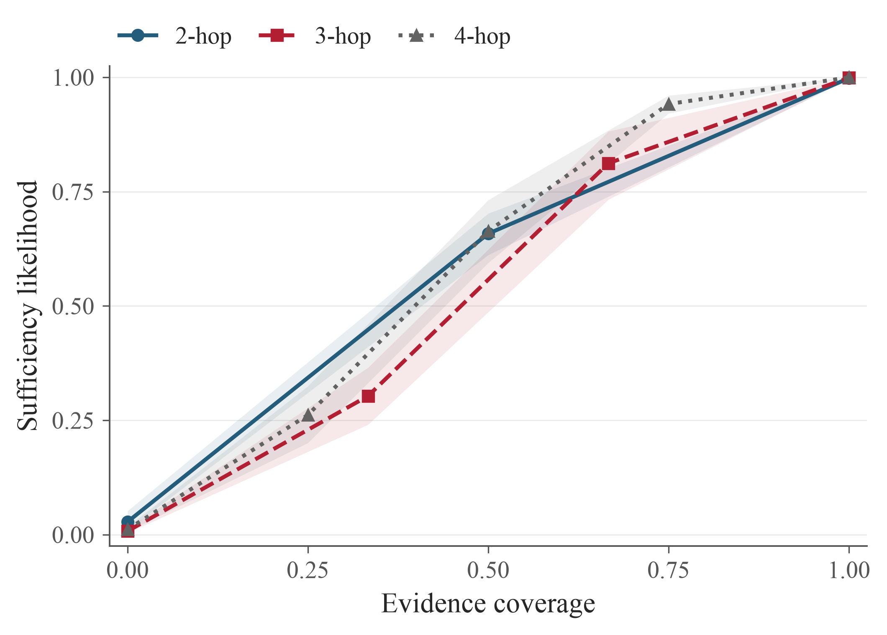
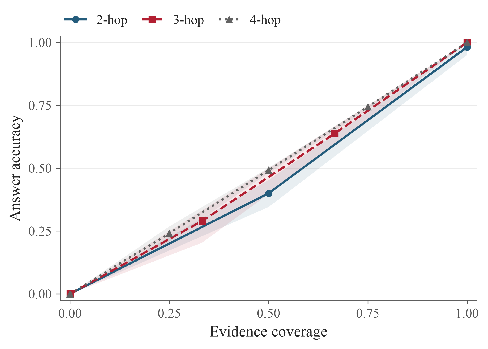
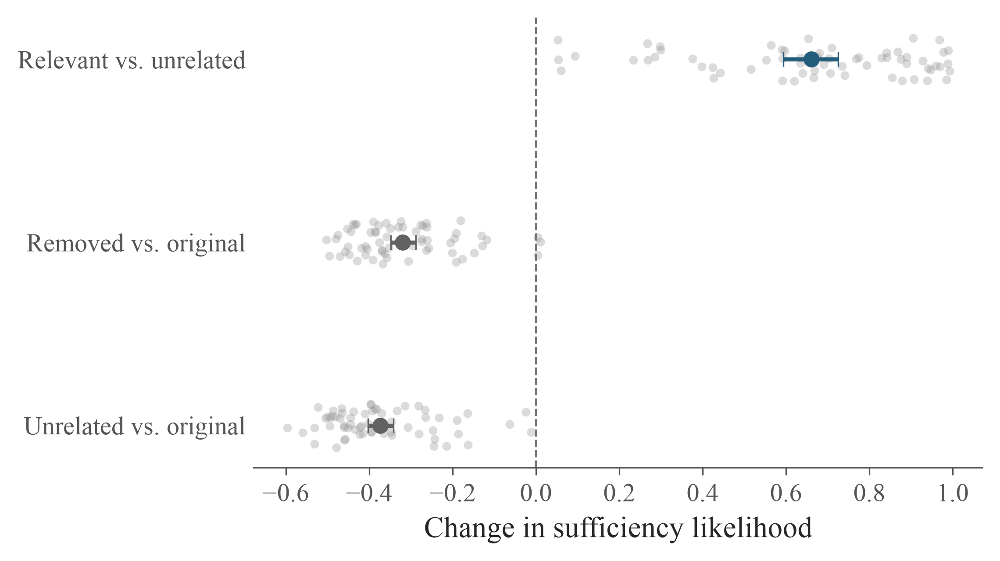
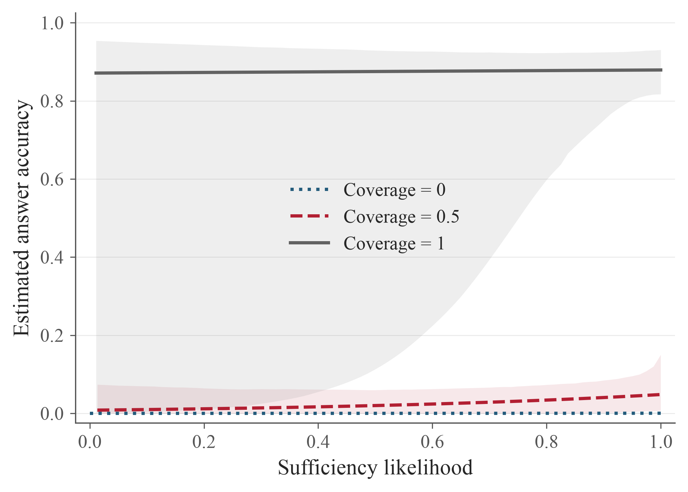

# 实验结果：Sufficiency likelihood 与证据覆盖率

全部 34,126 个推理任务已收齐。100 道题、2,150 个真实状态；每个回答条件 5 次独立生成。两个 Qwen 服务是同一模型的推理副本，不是两个不同模型。

其中 1,527 个最终答案使用了预先规定的空输出 no-thinking 回退。原空输出和回退响应均保留，没有将空输出直接当作答错；任务数指逻辑测量任务，不等于包含回退的全部 HTTP 调用次数。

另有 28 个任务因执行失败或输出不完整而按原参数补跑，归档了 44 次未完成记录；原输入、seed 和输出上限未变，没有因为答案错误而重试。原始记录位于 retry-history。补跑并不能保证消除与生成失败相关的选择偏差，需结合失败比例解释结果。

主分析使用 64 道无已知标准答案冲突的题目；全部 100 题及 36 道已知冲突题的结果另存。置信区间按题目重采样，不把状态和答案重复采样当成独立题目。

## 1. 补充标准证据会怎样？

固定问题、输入模板、证据槽数量和排列，用一条标准证据替换近似等长无关事实，likelihood 的平均配对变化为 0.449（95% 区间 0.428 至 0.466）。补齐最后一条标准证据时，变化为 0.288（95% 区间 0.247 至 0.331）。

图 1：各题先平均同覆盖率下的事实组合和正反排列，再跨题平均。三条线分别为 2、3、4 跳题目；阴影为逐点 95% 区间。它描述干净受控输入中的结果，不是自然轨迹的未经修改状态。

相同配对比较中，补齐最后一条标准证据时，答案正确率的平均变化为 0.517（95% 区间 0.465 至 0.567）。

图 2：每个证据组合独立回答 5 次，使用原 benchmark 评分器。图中的正确率来自当前组合，而非原轨迹最终答案。

## 2. 证据包不变，预览是否仍然有影响？

在 64 道题、564 个符合条件的真实状态中，相对无关预览，加入未入包标准事实的预览使 likelihood 平均变化 0.661（95% 区间 0.594 至 0.725）。该比较中证据包及 R 完全不变。

图 3：灰点代表题目层面的配对变化，深色点和横线为均值及 95% 区间。主要对比是相关预览与无关预览；另外两个对比使用各自符合条件的状态，因此样本集合可能不同，详见 preview-effects 表。文本排除检查不能证明不存在所有语义改写或模型参数知识。

## 3. Likelihood 能否提供覆盖率之外的答题信息？

图 4：使用当前状态证据包的答案，而不是整条轨迹最后的答案。曲线来自覆盖率、likelihood 及交互项的二项回归，展示样本支持范围内的拟合关系；不是留出测试的校准图。

进一步按题目分成 5 折测试，保证同题的所有轨迹和状态不跨训练/测试集。加入 likelihood 后，联合模型相对只用覆盖率模型的测试对数损失变化为 0.0065（95% 区间 -0.0023 至 0.0218）；负值代表预测误差减小，区间包含零则不能据此确认改善。

## 解释边界与核验状态

- R 是证据包中的标准事实覆盖率，不是证据条目总数，也不等于模型看见的全部信息。
- Likelihood 是既定 finish 前缀下的 sufficient/insufficient 条件比较，不是主动结束检索的概率。
- 标准证据链未必是唯一最小充分集合。低 R 时答对，不能直接解释为模型错误或测量失效。
- 本次回答禁用完整原文自动扩展，保证回答使用的事实与当前精确证据包对应。答案采样参数统一为 temperature=0.7、top_p=0.8、low reasoning。
- 初始字段排序错误的 pilot 已隔离，未用于本报告；正式 original 重放全部要求逐 token 匹配历史前缀。
- 相关系数见 correlations.csv；长度调整与配对效应见 unconflicted-coverage-effects.csv；回归与分题测试结果见 unconflicted-regression.csv 和 unconflicted-heldout-metrics.csv。
- 本报告为自动汇总。机械导出检查见 export-validation.json；人工视觉与案例复核仍需单独记录，不能由程序检查代替。

绘图采用 scientific-visualization skill 的可追溯导出与字体审计流程。软件方法来源：[Kassis et al., Scientific Agent Skills (2026)](https://doi.org/10.48550/arXiv.2609.00065)。
